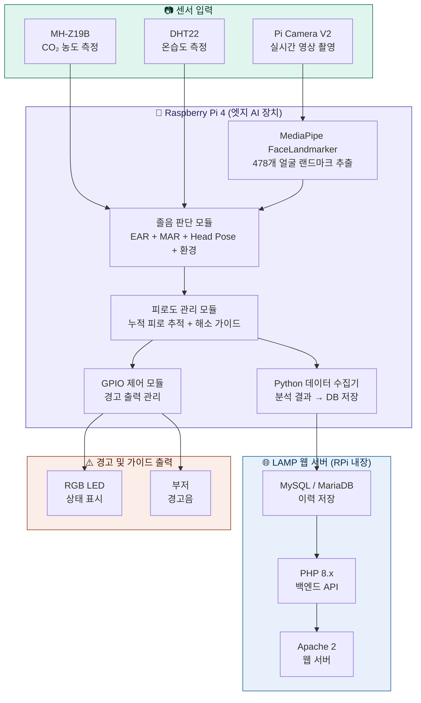
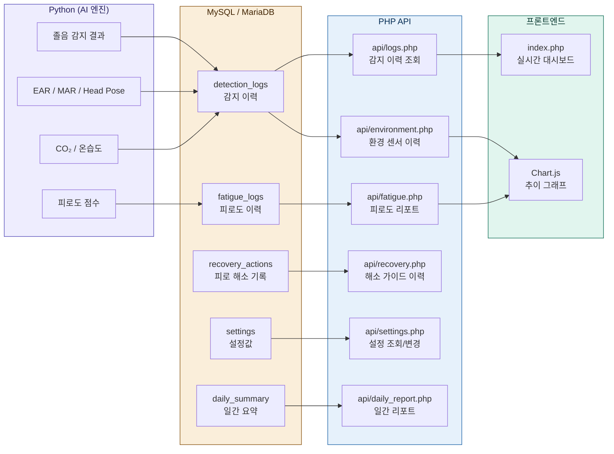
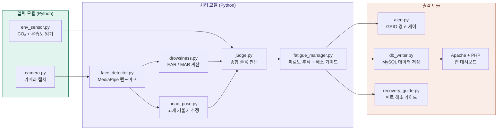
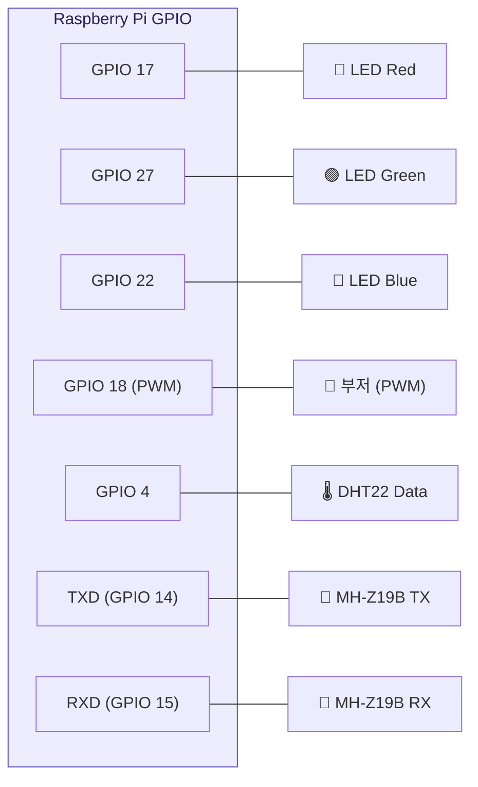
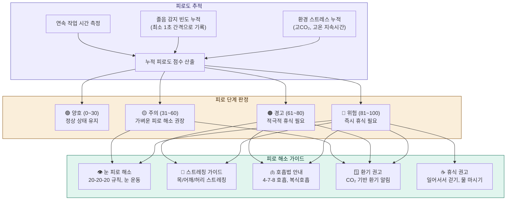
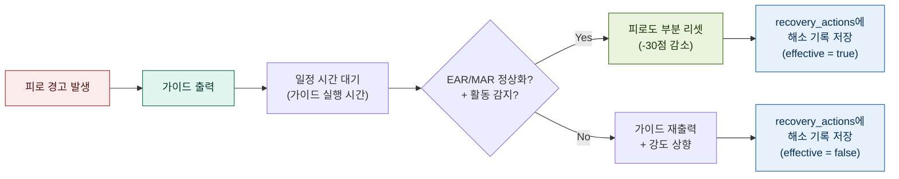
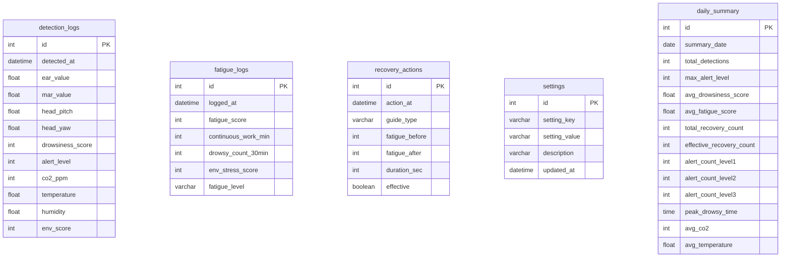
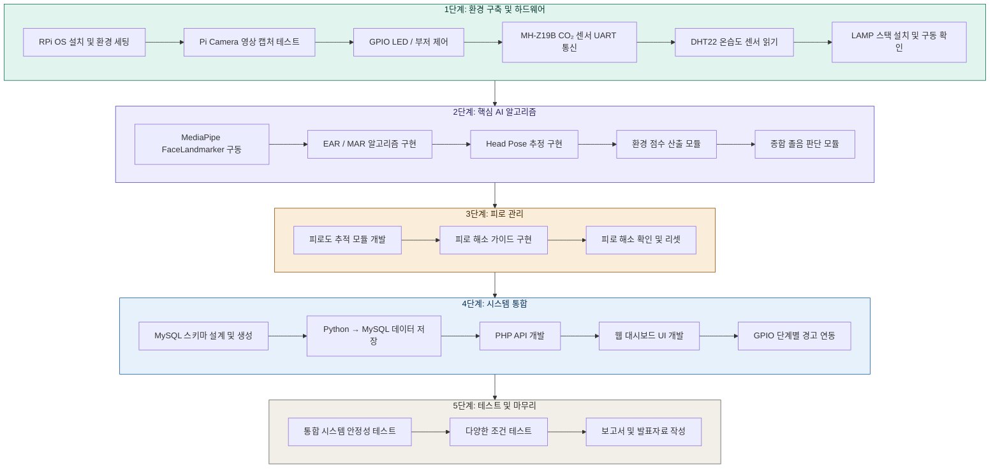
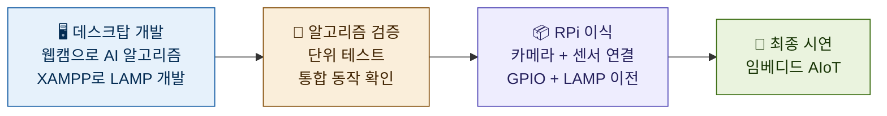
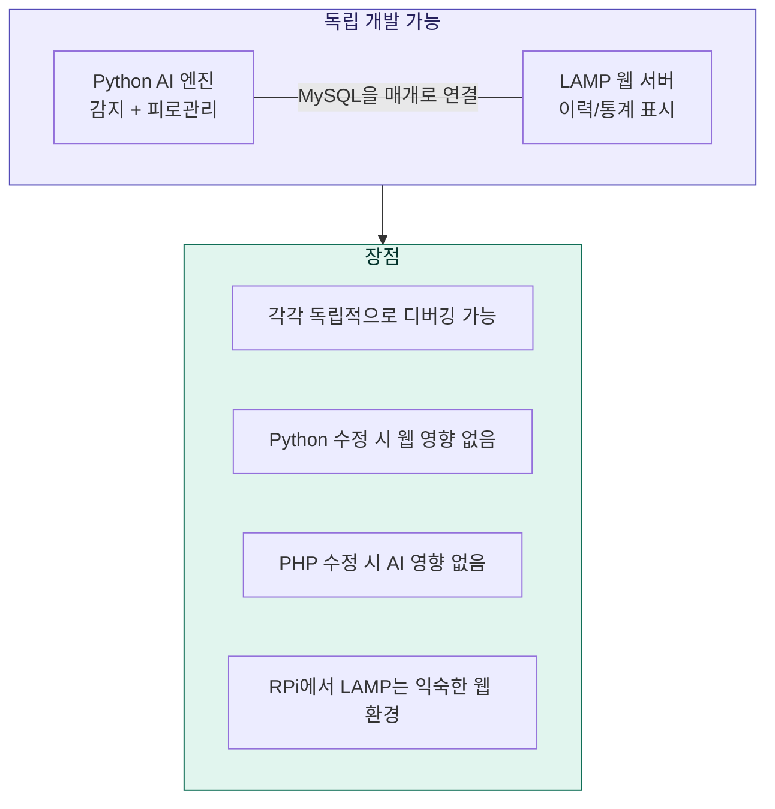

# AIoT 기반 졸음 및 집중력 저하 방지 시스템

## 1. 프로젝트 개요

| 항목 | 내용 |
|------|------|
| 프로젝트명 | AIoT 기반 졸음 및 집중력 저하 방지 시스템 |
| 전공 | 임베디드 소프트웨어 |
| 개발 인원 | 1인 |
| 핵심 기술 | Raspberry Pi, MediaPipe, OpenCV, LAMP Stack, GPIO |

본 프로젝트는 Raspberry Pi에 카메라와 환경 센서를 연결하여 사용자의 얼굴을 실시간으로 분석하고, AI 기반 졸음 및 집중력 저하를 감지하여 단계적 경고를 출력하는 임베디드 AIoT 시스템이다. 다중 센서 융합(EAR, MAR, Head Pose, CO₂, 온도, 습도)을 통해 종합적으로 졸음 상태를 판단하고, 누적 피로도를 추적하여 단계별 피로 해소 가이드를 제공한다. LAMP 스택 기반 웹 서버를 통해 감지 이력, 피로도 리포트 및 환경 데이터를 대시보드 형태로 제공한다.

### 1.1 목적

현대 사회에서 장시간 학습, 업무, 운전 등으로 인한 졸음과 집중력 저하는 학습 효율 감소, 업무 생산성 하락, 교통사고 등 심각한 문제를 유발한다. 기존의 졸음 감지 시스템은 단순히 경고만 울릴 뿐 근본적인 피로 관리를 제공하지 못한다는 한계가 있다.

본 프로젝트의 목적은 다음과 같다.

1. **다중 센서 융합 분석**: 카메라 영상(EAR, MAR, Head Pose)과 환경 센서(CO₂, 온도, 습도)를 종합적으로 분석하여 단일 센서 대비 높은 감지 정확도를 달성한다.
2. **능동적 피로 관리**: 졸음을 감지하는 것에 그치지 않고, 누적 피로도를 추적하고 피로 단계에 맞는 해소 가이드(스트레칭, 호흡법, 환기 권고 등)를 제공하여 근본적인 집중력 유지를 돕는다.
3. **엣지 AI 기반 임베디드 시스템 구현**: 클라우드에 의존하지 않고 Raspberry Pi 단독으로 AI 추론, 센서 제어, 웹 서버를 운영하여 네트워크 없이도 동작하는 자립형 시스템을 구현한다.
4. **웹 기반 모니터링**: LAMP 스택 웹 대시보드를 통해 실시간 상태, 이력 조회, 환경 추이 차트 등을 제공한다.

---

## 2. 시스템 구성도

### 2.1 전체 시스템 아키텍처



### 2.2 LAMP 스택 데이터 흐름



### 2.3 소프트웨어 모듈 구조



---

## 3. 하드웨어 구성

### 3.1 부품 목록

| 부품 | 모델 | 용도 |
|------|------|------|
| 메인 보드 | Raspberry Pi 4 (4GB) | 엣지 AI 처리 + LAMP 서버 |
| 카메라 | Pi Camera V2 | 얼굴 영상 촬영 |
| CO₂ 센서 | MH-Z19B | 이산화탄소 농도 측정 |
| 온습도 센서 | DHT22 | 실내 온도/습도 측정 |
| RGB LED | 공통 캐소드 | 상태 표시 (녹/황/적) |
| 부저 | 능동 부저 | 경고음 출력 |
| 기타 | 점퍼선, 브레드보드, 거치대 | 조립 및 고정 |

### 3.2 GPIO 핀 배치



### 3.3 환경 센서 사양

| 센서 | 측정 범위 | 정확도 | 통신 방식 | 졸음 임계값 |
|------|-----------|--------|-----------|-------------|
| MH-Z19B (CO₂) | 0\~5000ppm | ±50ppm | UART (9600bps) | 1000ppm 이상 → 집중력 저하 |
| DHT22 (온습도) | -40\~80°C / 0\~100%RH | ±0.5°C / ±2%RH | 디지털 1-Wire | 26°C 이상 → 졸음 유발 |

---

## 4. 핵심 알고리즘

### 4.1 졸음 감지 흐름


### 4.2 EAR (Eye Aspect Ratio) 계산

눈의 세로 길이 대비 가로 길이 비율로, 눈을 감으면 값이 급격히 감소한다.

```
EAR = (|P2 - P6| + |P3 - P5|) / (2 × |P1 - P4|)

- P1, P4: 눈의 좌우 끝점 (가로)
- P2, P3: 눈의 상단 점 (세로)
- P5, P6: 눈의 하단 점 (세로)

판정:
  EAR < 0.2 (고정 임계값) → 눈 감김 판정
  지속 시간: 2초 이상 연속 감김 → 졸음 판정

EAR 기반 점수 (0~100):
  눈 뜬 상태 (EAR >= 0.25)        → 0점
  눈 약간 감김 (0.2 <= EAR < 0.25) → 20점
  눈 감김 0.5초 미만               → 20점
  눈 감김 0.5~1.0초               → 40점
  눈 감김 1.0~2.0초               → 60점
  눈 감김 2.0~3.0초               → 80점
  눈 감김 3.0초 이상              → 100점
```

### 4.3 MAR (Mouth Aspect Ratio) 계산

입의 벌어진 정도를 측정하여 하품을 감지한다.

```
MAR = (|P2 - P8| + |P3 - P7| + |P4 - P6|) / (2 × |P1 - P5|)

(입 랜드마크 12개 포인트 사용)

판정:
  MAR > 0.6 (고정 임계값) → 하품 판정
  빈도: 3분 내 3회 이상 하품 → 졸음 전조

MAR 기반 점수 (0~100):
  하품 0회    → 0점
  하품 1회    → 20점
  하품 2회    → 40점
  하품 3~4회  → 70점
  하품 5회+   → 100점
  (현재 하품 중이면 +20점 추가)
```

### 4.4 Head Pose 추정

OpenCV `solvePnP`를 사용하여 얼굴의 6개 주요 포인트(코 끝, 턱, 좌우 눈, 좌우 입)로 Pitch, Yaw, Roll 각도를 추정한다.

```
Head Pose 기반 점수 (0~100):

Pitch (고개 숙임 - 가장 중요):
  -10° 이하 → 15점
  -15° 이하 → 30점
  -20° 이하 → 45점
  -30° 이하 → 60점

Yaw (좌우 돌림):
  20° 이상 → 5점
  30° 이상 → 15점
  45° 이상 → 25점

Roll (좌우 기울임):
  10° 이상 → 5점
  20° 이상 → 15점
  30° 이상 → 25점

(합산, 최대 100점)
```

### 4.5 종합 졸음 점수 산출

```
졸음 점수 = (W1 × EAR 점수) + (W2 × MAR 점수) + (W3 × Head Pose 점수) + (W4 × 환경 점수)

가중치:
  W1 = 0.35  (눈 감김 - 가장 직접적)
  W2 = 0.25  (하품 빈도)
  W3 = 0.20  (고개 기울기)
  W4 = 0.20  (환경)

점수 범위: 0 (완전 각성) ~ 100 (완전 졸음)
```

### 4.6 환경 점수 산출

```
환경 점수 = (E1 × CO₂ 점수) + (E2 × 온도 점수) + (E3 × 습도 점수)

가중치:
  E1 = 0.50  (CO₂ - 졸음 유발 연관성 최고)
  E2 = 0.30  (온도)
  E3 = 0.20  (습도)

CO₂ 점수:
  400~800ppm   → 0점 (쾌적)
  800~1000ppm  → 30점 (보통)
  1000~1500ppm → 60점 (나쁨, 환기 필요)
  1500ppm 이상 → 100점 (매우 나쁨)

온도 점수:
  18~24°C → 0점 (쾌적)
  24~26°C → 40점 (약간 높음)
  26~28°C → 70점 (졸음 유발)
  28°C 이상 → 100점 (매우 높음)

습도 점수:
  40~60%RH → 0점 (쾌적)
  60~70%RH → 40점 (약간 높음)
  70%RH 이상 → 80점 (불쾌)
```

### 4.7 경고 단계

| 졸음 점수 | 경고 단계 | LED | 부저 |
|-----------|-----------|-----|------|
| 0 ~ 30 | 0단계 (정상) | 녹색 | 없음 |
| 31 ~ 60 | 1단계 (주의) | 황색 (적+녹) | 짧은 비프 |
| 61 ~ 85 | 2단계 (경고) | 적색 | 연속 부저 (1kHz) |
| 86 ~ 100 | 3단계 (위험) | 적색 점멸 | 강한 연속 부저 (2kHz) |

---

## 5. 피로도 관리 시스템

### 5.1 피로도 관리 흐름



### 5.2 누적 피로도 점수 산출

```
피로도 = (F1 × 연속작업 점수) + (F2 × 졸음빈도 점수) + (F3 × 환경스트레스 점수)

가중치:
  F1 = 0.35  (연속 작업 시간)
  F2 = 0.40  (졸음 감지 빈도 - 가장 직접적)
  F3 = 0.25  (환경 스트레스 누적)

연속작업 점수:
  0~30분    → 0점
  30~60분   → 20점
  60~90분   → 50점
  90~120분  → 80점
  120분 이상 → 100점

졸음빈도 점수 (최근 30분 기준, 최소 1초 간격 카운트):
  0회     → 0점
  1~2회   → 30점
  3~5회   → 60점
  6회 이상 → 100점

환경스트레스 점수:
  CO₂ 1000ppm 이상이 10분 이상 지속 → +40점
  온도 26°C 이상이 10분 이상 지속   → +30점
  습도 70% 이상이 10분 이상 지속    → +20점
  (합산, 최대 100점)
```

### 5.3 피로 해소 가이드

| 피로 단계 | 제공 가이드 |
|-----------|-------------|
| 🟡 주의 (31~60) | 눈 피로 해소 → 환기 권고 |
| 🟠 경고 (61~80) | 스트레칭 → 호흡법 → 환기 권고 |
| 🔴 위험 (81~100) | 즉시 휴식 → 스트레칭 → 호흡법 → 환기 → 눈 피로 해소 |

가이드 데이터는 `data/guides.json`에 JSON 형태로 저장되어 있으며, 콘솔에 5분 간격으로 출력된다.

#### 피로 해소 가이드 내용

**👁️ 눈 피로 해소 (20-20-20 규칙)** (약 1분)
- 20초 동안 6m(20피트) 먼 곳 바라보기
- 눈 깜빡임 운동: 2초 감고 → 2초 뜨기를 5회 반복
- 안구 운동: 상하좌우, 원 그리기

**🧘 스트레칭 가이드** (약 2분)
- 목 스트레칭: 좌우 기울이기 각 15초
- 어깨 돌리기: 앞으로 10회, 뒤로 10회
- 허리 비틀기: 좌우 각 15초
- 손목 스트레칭: 손등 당기기 각 10초

**🫁 호흡법 안내** (약 1분 30초)
- 4-7-8 호흡법: 4초 들이쉬고 → 7초 참고 → 8초 내쉬기 (3회 반복)
- 복식호흡: 배를 부풀리며 5초 들이쉬고 → 5초 내쉬기 (5회 반복)

**🪟 환기 권고** (약 5분)
- 가까운 창문을 열어 5분 이상 환기
- CO₂ 농도가 800ppm 이하로 내려올 때까지 유지
- 환기가 어려운 경우 잠시 실외로 나가기

**☕ 휴식 권고** (약 5분)
- 자리에서 일어나 2~3분 걷기
- 물 한 잔 마시기 (수분 부족은 피로 원인)
- 가벼운 간식 (혈당 유지)
- 5분 이상 완전한 휴식

### 5.4 피로 해소 확인 및 리셋



---

## 6. 웹 서버 (LAMP 스택)

### 6.1 LAMP 스택 구성

| 계층 | 기술 | 역할 |
|------|------|------|
| **L**inux | Raspberry Pi OS (Debian 기반) | 운영체제 |
| **A**pache | Apache 2.4 | 웹 서버 |
| **M**ySQL | MariaDB 10.x | 이력, 설정값 저장 |
| **P**HP | PHP 8.x | 백엔드 API |

### 6.2 데이터베이스 스키마



### 6.3 주요 PHP API 엔드포인트

| 엔드포인트 | 메서드 | 설명 |
|------------|--------|------|
| `/` | GET | 메인 페이지 (실시간 대시보드) |
| `/api/logs.php` | GET | 감지 이력 목록 (페이징, 날짜 필터) |
| `/api/fatigue.php` | GET | 피로도 이력 (today/week/month) |
| `/api/recovery.php` | GET | 피로 해소 기록 및 효과 통계 |
| `/api/environment.php` | GET | 환경 센서 이력 (CO₂/온도/습도) |
| `/api/settings.php` | GET/POST | 임계값, 가중치 설정 조회/변경 |
| `/api/daily_report.php` | GET | 일간 요약 리포트 (집계 또는 실시간) |

### 6.4 웹 대시보드 기능

- **상태 카드**: 현재 피로도, 오늘 감지 횟수, 경고 횟수, 실내 환경 (CO₂/온습도)
- **졸음 점수 차트**: 최근 24시간 졸음 점수 추이 (경고 기준선 표시)
- **피로도 차트**: 오늘 피로도 변화 추이
- **환경 센서 차트**: CO₂, 온도, 습도 이중 축 그래프
- **감지 이력 테이블**: 최근 20건 상세 이력
- **피로 해소 기록 테이블**: 해소 시도 이력 및 효과 여부
- **자동 갱신**: 10초마다 대시보드 데이터 자동 새로고침

### 6.5 Python ↔ MySQL 연동 방식

```
[Python AI 엔진] --INSERT--> [MySQL/MariaDB] --SELECT--> [PHP API] --JSON--> [웹 브라우저]
```

Python과 PHP가 DB를 매개로 완전히 분리되어, 각각 독립적으로 개발·디버깅이 가능하다.

---

## 7. 개발 단계

### 7.1 단계별 로드맵



### 7.2 단계별 상세 내용

#### 1단계: 환경 구축 및 하드웨어 테스트

- Raspberry Pi OS 설치, Python 3.9+, OpenCV, MediaPipe 설치
- Pi Camera V2 연결 및 영상 캡처 테스트
- GPIO 핀으로 RGB LED, 부저 개별 제어 확인
- MH-Z19B CO₂ 센서 UART 통신 테스트
- DHT22 온습도 센서 데이터 읽기 테스트
- LAMP 스택 설치: Apache, MariaDB, PHP 설치 및 기본 동작 확인
- **마일스톤**: 카메라 영상 출력 + LED 점멸 + CO₂/온습도 값 콘솔 출력 + Apache 접속 확인

#### 2단계: 핵심 AI 알고리즘 구현

- MediaPipe FaceLandmarker Tasks API로 478개 랜드마크 추출
- EAR, MAR 계산 함수 구현 및 단위 테스트
- Head Pose Estimation (solvePnP) 구현
- 환경 점수 산출 모듈 개발 및 단위 테스트
- 종합 졸음 판단 모듈 개발 (가중 합산)
- **마일스톤**: 졸음 감지 + 환경 점수 반영 동작 확인

#### 3단계: 피로 관리

- 피로도 추적 모듈 개발 (연속 작업, 졸음 빈도, 환경 스트레스)
- 피로 해소 가이드 JSON 데이터 구성 및 콘솔 출력 구현
- 피로 해소 확인 및 피로도 부분 리셋 로직
- **마일스톤**: 졸음 반복 시 피로도 상승 + 가이드 자동 제공

#### 4단계: 시스템 통합

- MySQL 스키마 설계 및 전체 테이블 생성
- Python → MySQL 데이터 저장 모듈 개발 (주기적 저장)
- PHP REST API 개발 (이력, 피로도, 해소 기록, 환경, 설정, 일간 리포트)
- Chart.js 기반 웹 대시보드 UI 개발
- GPIO 단계별 경고 연동
- **마일스톤**: 전체 파이프라인 동작 (감지 → 판단 → 경고 → DB → 웹 조회)

#### 5단계: 테스트 및 마무리

- 통합 시스템 안정성 테스트 (장시간 연속 가동)
- 다양한 조건 테스트: 안경 착용, 어두운 환경, 다양한 각도
- 피로 해소 가이드 효과 검증 (가이드 전후 졸음 점수 비교)
- 프로젝트 보고서 작성 및 발표 준비
- **마일스톤**: 라이브 데모 가능한 완성 시스템

---

## 8. 개발 전략

### 8.1 데스크탑 선행 개발 → RPi 이식



- 코어 AI 로직은 데스크탑에서 웹캠으로 먼저 개발
- 환경 센서는 데스크탑에서 더미 데이터로 테스트 후 RPi에서 실제 연결
- LAMP 웹 파트는 XAMPP로 병행 개발
- 카메라 입력부, GPIO, 센서 통신부만 RPi에서 조정

### 8.2 Python ↔ LAMP 분리 아키텍처의 장점



---

## 9. 프로젝트 디렉토리 구조

```
capstone_project/
├── main.py                    # 메인 실행 파일 (AI 엔진)
├── config.py                  # 설정값 (가중치, GPIO 핀, DB 접속정보)
├── requirements.txt           # Python 패키지 목록
│
├── modules/
│   ├── camera.py              # 카메라 캡처 모듈
│   ├── face_detector.py       # MediaPipe FaceLandmarker (478개 랜드마크)
│   ├── drowsiness.py          # EAR / MAR 계산 + 졸음 상태 추적
│   ├── head_pose.py           # 고개 기울기 추정 (solvePnP)
│   ├── env_sensor.py          # CO₂ (MH-Z19B) + 온습도 (DHT22)
│   ├── judge.py               # 종합 졸음 판단 (가중 합산)
│   ├── fatigue_manager.py     # 피로도 추적 + 해소 가이드 추천
│   ├── recovery_guide.py      # 피로 해소 가이드 데이터 및 출력
│   ├── alert.py               # GPIO 경고 출력 제어 (LED + 부저)
│   └── db_writer.py           # MySQL 데이터 저장
│
├── data/
│   └── guides.json            # 피로 해소 가이드 데이터 (JSON)
│
├── models/
│   └── face_landmarker.task   # MediaPipe FaceLandmarker 모델 파일
│
├── web/                       # Apache DocumentRoot (/var/www/html)
│   ├── index.php              # 메인 페이지 (실시간 대시보드)
│   ├── api/
│   │   ├── logs.php           # 감지 이력 API
│   │   ├── fatigue.php        # 피로도 이력 API
│   │   ├── recovery.php       # 해소 기록 API
│   │   ├── environment.php    # 환경 센서 이력 API
│   │   ├── settings.php       # 설정 조회/변경 API
│   │   └── daily_report.php   # 일간 리포트 API
│   ├── includes/
│   │   └── db.php             # MySQL 접속 공통 모듈
│   ├── css/
│   │   └── style.css          # 대시보드 스타일
│   └── js/
│       ├── main.js            # 대시보드 로직
│       └── chart_config.js    # Chart.js 설정
│
├── sql/
│   └── schema.sql             # MySQL 테이블 생성 스크립트
│
├── tests/
│   ├── test_ear.py            # EAR 알고리즘 단위 테스트
│   ├── test_mar.py            # MAR 알고리즘 단위 테스트
│   ├── test_fatigue.py        # 피로도 관리 단위 테스트
│   ├── test_env_sensor.py     # 환경 점수 산출 테스트
│   └── test_gpio.py           # GPIO 동작 테스트
│
└── docs/
    └── wiring_diagram.md      # 배선도
```

---

## 10. 참고 기술 및 라이브러리

### 10.1 AI / 임베디드 (Python)

| 기술 | 버전 | 용도 |
|------|------|------|
| Python | 3.9+ | 메인 AI 엔진 개발 언어 |
| OpenCV | 4.8+ | 영상 처리, solvePnP |
| MediaPipe | 0.10+ | FaceLandmarker Tasks API (얼굴 랜드마크) |
| RPi.GPIO | 0.7+ | GPIO 핀 제어 (LED, 부저) |
| pymysql | 1.1+ | Python → MySQL 데이터 저장 |
| pyserial | 3.5+ | MH-Z19B UART 통신 |
| Adafruit_DHT | 1.4+ | DHT22 센서 읽기 |
| NumPy | 1.24+ | 수치 계산 |

### 10.2 웹 서버 (LAMP 스택)

| 기술 | 버전 | 용도 |
|------|------|------|
| Raspberry Pi OS | Debian 12 기반 | Linux 운영체제 |
| Apache | 2.4+ | 웹 서버 |
| MariaDB | 10.x | 관계형 데이터베이스 |
| PHP | 8.x | 백엔드 API |
| Chart.js | 4.x | 통계/추이 그래프 시각화 |
| chartjs-plugin-annotation | 3.x | 차트 기준선 표시 |

---

## 11. 예상 성과 및 확장 가능성

### 예상 성과
- 졸음 감지 정확도: 90% 이상 (다중 센서 융합)
- 실시간 처리 속도: 10\~15fps (RPi 4 기준)
- 경고 응답 시간: 졸음 감지 후 1초 이내
- 피로 해소 가이드 효과: 가이드 제공 후 졸음 점수 20% 이상 감소 목표

### 향후 확장
- **개인화 시스템**: 캘리브레이션을 통한 개인별 baseline 측정 및 비율 기반 졸음 판단 (고정 임계값 → 개인 맞춤 임계값)
- **패턴 학습**: 시간대별 졸음 패턴 분석, 피로 해소법 효과 분석, 환경 민감도 학습
- **다중 사용자 프로필**: user_profiles 테이블 기반 다중 사용자 지원
- 스마트폰 실시간 모니터링 (MJPEG 스트리밍 + AJAX 대시보드)
- 스마트워치 연동 (심박수, GSR 데이터 추가)
- 소형 팬, 진동 모터 등 추가 경고/각성 장치 확장
- TFLite 경량 모델 학습 (개인별 졸음/피로 패턴 딥러닝)
- 다중 사용자 동시 감지 (교실, 사무실 환경)
- 차량 환경 적용 (OBD-II 연동, CAN 통신)
