# AIoT 기반 졸음 및 집중력 저하 방지 시스템

## 1. 프로젝트 개요

| 항목 | 내용 |
|------|------|
| 프로젝트명 | AIoT 기반 졸음 및 집중력 저하 방지 시스템 |
| 전공 | 임베디드 소프트웨어 |
| 개발 인원 | 1인 |
| 핵심 기술 | Raspberry Pi, MediaPipe, OpenCV, Django, Docker, GPIO, 로컬 LLM (Ollama) |

본 프로젝트는 Raspberry Pi에 카메라와 환경 센서를 연결하여 사용자의 얼굴을 실시간으로 분석하고, AI 기반 졸음 및 집중력 저하를 감지하여 단계적 경고를 출력하는 임베디드 AIoT 시스템이다. 다중 센서 융합(EAR, MAR, Head Pose, CO₂, 온도, 습도)을 통해 종합적으로 졸음 상태를 판단하고, 누적 피로도를 추적하여 단계별 피로 해소 가이드를 제공한다. 또한 데스크탑 환경에서는 **로컬 LLM(Ollama)**을 연동하여 개인 상태·원인·회복 이력을 반영한 **맞춤형 대화체 코칭**을 제공한다. **Django** 기반 웹 서버를 통해 감지 이력, 피로도 리포트 및 환경 데이터를 대시보드 형태로 제공한다. 데스크탑 개발 환경에서는 AI 엔진(`main.py`)을 호스트에서 직접 실행하여 웹캠/USB에 직접 접근하고, MySQL·Django·Ollama는 **Docker Compose**로 컨테이너화하여 운영한다(RPi 이식 단계에서는 모든 구성요소가 단일 보드에서 실행된다).

### 1.1 목적

현대 사회에서 장시간 학습, 업무, 운전 등으로 인한 졸음과 집중력 저하는 학습 효율 감소, 업무 생산성 하락, 교통사고 등 심각한 문제를 유발한다. 기존의 졸음 감지 시스템은 단순히 경고만 울릴 뿐 근본적인 피로 관리를 제공하지 못한다는 한계가 있다.

본 프로젝트의 목적은 다음과 같다.

1. **다중 센서 융합 분석**: 카메라 영상(EAR, MAR, Head Pose)과 환경 센서(CO₂, 온도, 습도)를 종합적으로 분석하여 단일 센서 대비 높은 감지 정확도를 달성한다.
2. **능동적 피로 관리**: 졸음을 감지하는 것에 그치지 않고, 누적 피로도를 추적하고 피로 단계에 맞는 해소 가이드(스트레칭, 호흡법, 환기 권고 등)를 제공하여 근본적인 집중력 유지를 돕는다.
3. **엣지 AI 기반 임베디드 시스템 구현**: 클라우드에 의존하지 않고 Raspberry Pi 단독으로 AI 추론, 센서 제어, 웹 서버를 운영하여 네트워크 없이도 동작하는 자립형 시스템을 구현한다.
4. **로컬 LLM 기반 개인화 코칭**: 외부 API 의존 없이 Ollama 기반 로컬 LLM을 활용하여 개인 상태(피로 원인, 작업시간, 환경, 회복 이력)를 반영한 맞춤형 졸음 관리 조언을 제공한다. 프라이버시 보호와 네트워크 독립성을 동시에 달성한다.
5. **웹 기반 모니터링**: Django 웹 대시보드를 통해 실시간 상태, 이력 조회, 환경 추이 차트 등을 제공한다.

---

## 2. 시스템 구성도

### 2.1 전체 시스템 아키텍처

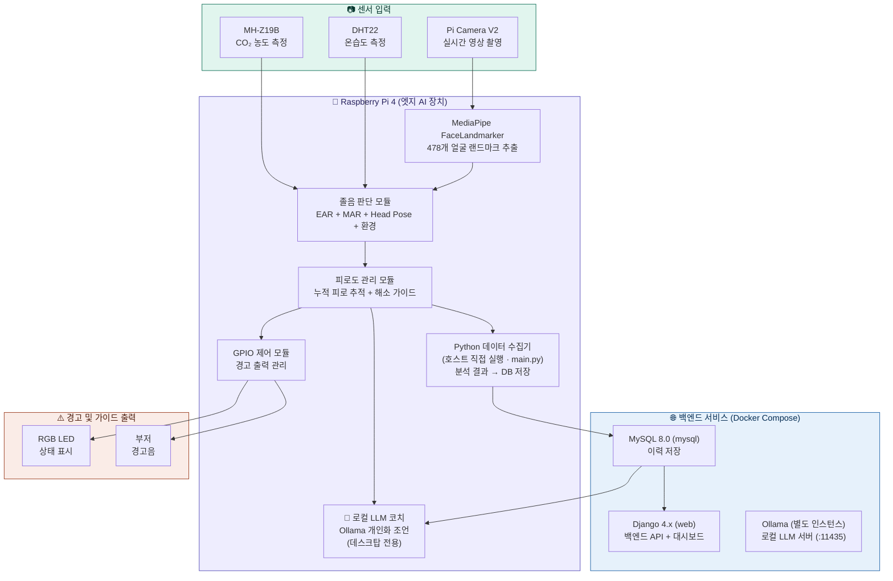

### 2.2 Django 데이터 흐름

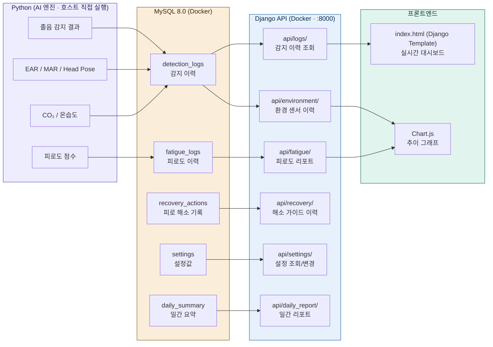

### 2.3 소프트웨어 모듈 구조

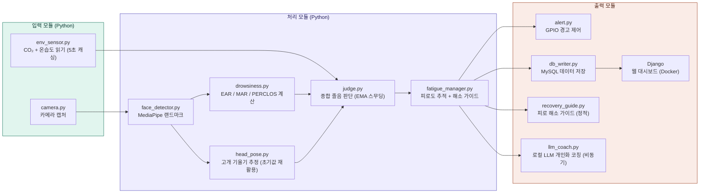

---

## 3. 하드웨어 구성

### 3.1 부품 목록

| 부품 | 모델 | 용도 |
|------|------|------|
| 메인 보드 | Raspberry Pi 4 (4GB) | 엣지 AI 처리 + LAMP 서버 |
| 카메라 | Pi Camera V2 | 얼굴 영상 촬영 |
| CO₂ 센서 | MH-Z19B | 이산화탄소 농도 측정 |
| 온습도 센서 | DHT22 | 실내 온도/습도 측정 |
| RGB LED | 공통 캐소드 | 상태 표시 (녹/황/적) |
| 부저 | 능동 부저 | 경고음 출력 |
| 기타 | 점퍼선, 브레드보드, 거치대 | 조립 및 고정 |

### 3.2 GPIO 핀 배치

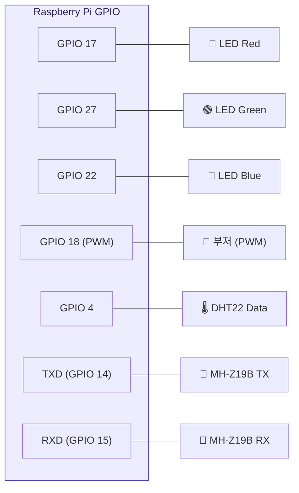

### 3.3 환경 센서 사양

| 센서 | 측정 범위 | 정확도 | 통신 방식 | 졸음 임계값 |
|------|-----------|--------|-----------|-------------|
| MH-Z19B (CO₂) | 0\~5000ppm | ±50ppm | UART (9600bps) | 1000ppm 이상 → 집중력 저하 |
| DHT22 (온습도) | -40\~80°C / 0\~100%RH | ±0.5°C / ±2%RH | 디지털 1-Wire | 26°C 이상 → 졸음 유발 |

---

## 4. 핵심 알고리즘

### 4.1 졸음 감지 흐름

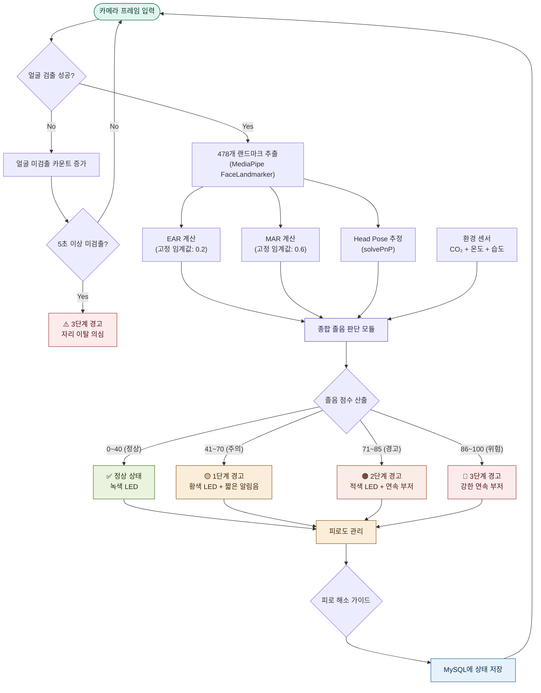

### 4.2 EAR (Eye Aspect Ratio) 계산

눈의 세로 길이 대비 가로 길이 비율로, 눈을 감으면 값이 급격히 감소한다. 거리 계산에 `math.hypot`을 사용하여 `np.linalg.norm` 대비 연산을 경량화하였다.

```
EAR = (|P2 - P6| + |P3 - P5|) / (2 × |P1 - P4|)

- P1, P4: 눈의 좌우 끝점 (가로)
- P2, P3: 눈의 상단 점 (세로)
- P5, P6: 눈의 하단 점 (세로)

판정:
  EAR < 0.2 (고정 임계값) → 눈 감김 판정
  지속 시간: 2초 이상 연속 감김 → 졸음 판정

EAR 기반 점수 (0~100, 선형 보간):
  눈 감김 지속시간에 따라 구간별 선형 보간으로 부드럽게 점수 산출
  (0초, 0점) → (0.3초, 10점) → (0.5초, 20점) → (1.0초, 40점)
  → (2.0초, 60점) → (3.0초, 80점) → (4.0초, 100점)

  눈이 떠있어도 PERCLOS 비율에 따라 기본 점수 반영
  눈 감김 시 PERCLOS 보너스 가산 (최근 감김 빈도 반영)
```

#### PERCLOS (Percentage of Eye Closure)

학술적으로 검증된 졸음 지표로, 최근 60초 슬라이딩 윈도우 내에서 눈이 감겨 있던 시간의 비율(%)을 추적한다.

```
PERCLOS = (60초 내 눈 감김 시간 / 60초) × 100

- PERCLOS 15% 이상 → 졸음 전조 (EAR 점수에 가산)
- 눈이 떠있는 상태에서도 최근 감김 빈도를 반영하여 졸음 경향 조기 감지
- 단순 연속 감김 시간 외에 빈번한 짧은 감김도 포착 가능
```

### 4.3 MAR (Mouth Aspect Ratio) 계산

입의 벌어진 정도를 측정하여 하품을 감지한다.

```
MAR = (|P2 - P8| + |P3 - P7| + |P4 - P6|) / (2 × |P1 - P5|)

(입 랜드마크 12개 포인트 사용)

판정:
  MAR > 0.6 (고정 임계값) → 하품 판정
  빈도: 3분 내 3회 이상 하품 → 졸음 전조

MAR 기반 점수 (0~100, 선형 보간):
  하품 횟수에 따라 구간별 선형 보간으로 부드럽게 점수 산출
  (0회, 0점) → (1회, 15점) → (2회, 30점) → (3회, 50점)
  → (5회, 80점) → (7회, 100점)
  (현재 하품 중이면 +20점 추가)
```

### 4.4 Head Pose 추정

OpenCV `solvePnP`를 사용하여 얼굴의 6개 주요 포인트(코 끝, 턱, 좌우 눈, 좌우 입)로 Pitch, Yaw, Roll 각도를 추정한다. 이전 프레임의 회전/이동 벡터를 초기값(`useExtrinsicGuess=True`)으로 활용하여 반복 수렴 속도를 향상시켰다.

```
Head Pose 기반 점수 (0~100, 선형 보간):

각 축의 각도에 따라 구간별 선형 보간으로 부드럽게 점수 산출

Pitch (고개 숙임 - 가장 중요):
  (0°, 0점) → (10°, 10점) → (15°, 25점) → (20°, 40점)
  → (30°, 60점) → (45°, 80점) → (60°, 100점)

Yaw (좌우 돌림):
  (0°, 0점) → (20°, 5점) → (30°, 15점) → (45°, 25점) → (60°, 35점)

Roll (좌우 기울임):
  (0°, 0점) → (10°, 5점) → (20°, 15점) → (30°, 25점) → (45°, 35점)

(합산, 최대 100점)
```

### 4.5 종합 졸음 점수 산출

```
졸음 점수 = EMA( (W1 × EAR 점수) + (W2 × MAR 점수) + (W3 × Head Pose 점수) + (W4 × 환경 점수) )

가중치:
  W1 = 0.35  (눈 감김 - 가장 직접적)
  W2 = 0.25  (하품 빈도)
  W3 = 0.20  (고개 기울기)
  W4 = 0.20  (환경)

EMA 스무딩 (지수이동평균):
  α = 0.3
  EMA_t = α × raw_score + (1 - α) × EMA_(t-1)
  → 프레임 간 급격한 점수 변동을 완화하여 경고 단계 플리커링 방지

점수 범위: 0 (완전 각성) ~ 100 (완전 졸음)
```

### 4.6 환경 점수 산출

```
환경 점수 = (E1 × CO₂ 점수) + (E2 × 온도 점수) + (E3 × 습도 점수)

가중치:
  E1 = 0.50  (CO₂ - 졸음 유발 연관성 최고)
  E2 = 0.30  (온도)
  E3 = 0.20  (습도)

CO₂ 점수 (선형 보간):
  (0ppm, 0점) → (800ppm, 0점) → (1000ppm, 30점) → (1500ppm, 60점) → (2000ppm, 100점)

온도 점수 (선형 보간):
  (18°C, 0점) → (24°C, 0점) → (26°C, 40점) → (28°C, 70점) → (30°C, 100점)

습도 점수 (선형 보간):
  (40%RH, 0점) → (60%RH, 0점) → (70%RH, 40점) → (80%RH, 80점) → (90%RH, 100점)
```

### 4.7 경고 단계

| 졸음 점수 | 경고 단계 | LED | 부저 |
|-----------|-----------|-----|------|
| 0 ~ 40 | 0단계 (정상) | 녹색 | 없음 |
| 41 ~ 70 | 1단계 (주의) | 황색 (적+녹) | 짧은 비프 |
| 71 ~ 85 | 2단계 (경고) | 적색 | 연속 부저 (1kHz) |
| 86 ~ 100 | 3단계 (위험) | 적색 점멸 | 강한 연속 부저 (2kHz) |

---

## 5. 피로도 관리 시스템

### 5.1 피로도 관리 흐름

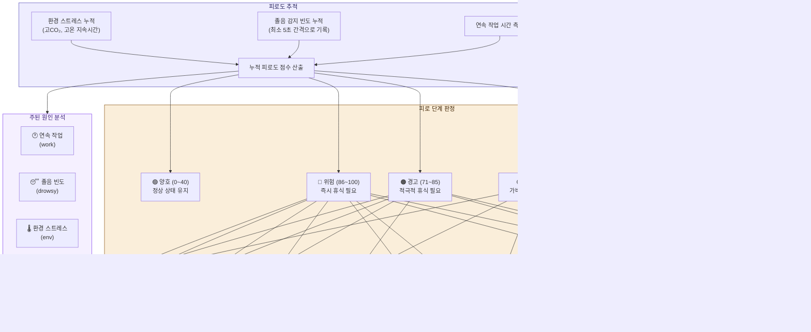

### 5.2 누적 피로도 점수 산출

```
피로도 = (F1 × 연속작업 점수) + (F2 × 졸음빈도 점수) + (F3 × 환경스트레스 점수)

가중치:
  F1 = 0.35  (연속 작업 시간)
  F2 = 0.40  (졸음 감지 빈도 - 가장 직접적)
  F3 = 0.25  (환경 스트레스 누적)

연속작업 점수 (선형 보간):
  (0분, 0점) → (30분, 0점) → (60분, 20점) → (90분, 50점)
  → (120분, 80점) → (150분, 100점)

졸음빈도 점수 (최근 30분 기준, 최소 5초 간격 카운트, 선형 보간):
  (0회, 0점) → (3회, 10점) → (5회, 20점) → (10회, 40점)
  → (15회, 50점) → (20회, 65점) → (30회, 80점) → (40회, 100점)

환경스트레스 점수 (지속시간 비례 선형 보간):
  임계값 도달 전에도 지속시간에 비례하여 점수가 서서히 상승
  CO₂ ≥ 1000ppm: (0분, 0점) → (5분, 10점) → (10분, 40점) → (20분, 50점)
  온도 ≥ 26°C:   (0분, 0점) → (5분, 8점) → (10분, 30점) → (20분, 35점)
  습도 ≥ 70%:    (0분, 0점) → (5분, 5점) → (10분, 20점) → (20분, 25점)
  (합산, 최대 100점)

효율 최적화:
  - Breakpoint를 x/y 분리 튜플로 사전 계산하여 매 프레임 리스트 할당 제거
  - bisect 이진 탐색으로 구간 탐색 O(n) → O(log n)
  - 환경 스트레스 threshold 곱셈(×0.5, ×2.0) __init__에서 1회 사전 계산
  - 연속작업 점수 1초 캐싱 (분 단위로만 변하므로 30FPS 기준 계산 횟수 1/30)
```

### 5.3 원인 기반 맞춤 피로 해소 가이드

피로의 **주된 원인**(연속 작업 / 졸음 빈도 / 환경 스트레스)을 분석하여, 피로 단계별 기본 가이드에 원인별 맞춤 가이드를 추가 제공한다. 가이드 데이터는 `data/guides.json`에 JSON 형태로 저장되어 있으며, 콘솔에 5분 간격으로 출력된다.

```
주된 원인 판별:
  각 요인(연속작업, 졸음빈도, 환경스트레스)의 개별 점수를 비교하여
  가장 높은 점수의 요인을 dominant_cause로 선정
```

#### 단계별 기본 + 원인별 가이드 매핑

| 피로 단계 | 기본 가이드 | + 연속작업(work) | + 졸음(drowsy) | + 환경(env) |
|-----------|------------|-----------------|---------------|------------|
| 🟡 주의 (41~70) | 눈 피로 해소 | 자세 교정, 수분 보충 | 냉수 세안, 호흡법 | 환기 권고 |
| 🟠 경고 (71~85) | 스트레칭, 눈 피로 해소 | 산책, 수분 보충, 자세 교정 | 냉수 세안, 호흡법, 카페인 | 환기 권고, 호흡법 |
| 🔴 위험 (86~100) | 즉시 휴식, 스트레칭, 눈 피로 해소 | 산책, 수분 보충 | 냉수 세안, 카페인, 호흡법 | 환기 권고, 산책 |

#### 피로 해소 가이드 내용 (10종)

**👁️ 눈 피로 해소 (20-20-20 규칙)** (약 1분)
- 20초 동안 6m(20피트) 먼 곳 바라보기
- 눈 깜빡임 운동: 2초 감고 → 2초 뜨기를 5회 반복
- 안구 운동: 상하좌우, 원 그리기

**🧘 스트레칭 가이드** (약 2분)
- 목 스트레칭: 좌우 기울이기 각 15초
- 어깨 돌리기: 앞으로 10회, 뒤로 10회
- 허리 비틀기: 좌우 각 15초
- 손목 스트레칭: 손등 당기기 각 10초

**🫁 호흡법 안내** (약 1분 30초)
- 4-7-8 호흡법: 4초 들이쉬고 → 7초 참고 → 8초 내쉬기 (3회 반복)
- 복식호흡: 배를 부풀리며 5초 들이쉬고 → 5초 내쉬기 (5회 반복)

**🪟 환기 권고** (약 5분)
- 가까운 창문을 열어 5분 이상 환기
- CO₂ 농도가 800ppm 이하로 내려올 때까지 유지
- 환기가 어려운 경우 잠시 실외로 나가기

**☕ 휴식 권고** (약 5분)
- 자리에서 일어나 2~3분 걷기
- 물 한 잔 마시기 (수분 부족은 피로 원인)
- 가벼운 간식 (혈당 유지)
- 5분 이상 완전한 휴식

**🧊 냉수 세안** (약 1분)
- 찬물로 얼굴을 3~4회 가볍게 세안
- 목 뒤에도 찬물을 적셔 각성도 향상
- 수건으로 가볍게 두드리며 마무리

**💧 수분 보충** (약 30초)
- 물 한 잔(200~300ml) 천천히 마시기
- 카페인 음료 대신 미지근한 물이나 허브차 권장
- 1시간 간격 수분 보충 습관화

**🪑 자세 교정** (약 30초)
- 등을 의자 등받이에 붙이고 허리를 바로 세우기
- 모니터 상단이 눈높이와 일치하도록 조절
- 키보드와 팔꿈치 높이를 맞추고 어깨 힘 빼기
- 발바닥이 바닥에 완전히 닿도록 의자 높이 조절

**☕ 카페인 섭취 권장** (약 1분)
- 커피 1잔(150~200ml) 또는 녹차 1잔 섭취
- 효과는 섭취 후 약 20~30분 뒤에 발현
- 하루 총량 400mg(커피 약 4잔) 초과 금지
- 오후 3시 이후 카페인은 수면에 영향

**🚶 가벼운 산책** (약 5분)
- 자리에서 일어나 5분간 가볍게 걷기
- 가능하면 실외에서 걸으며 신선한 공기 호흡
- 계단 오르내리기도 효과적
- 돌아온 후 가벼운 스트레칭으로 마무리

### 5.4 회복 효과 검증 시스템 (RecoverySession)

가이드 제공 후 **생체 데이터를 재측정**하여 실제 회복 효과를 검증한다. `RecoverySession` 클래스가 세션을 추적하며, 3단계(recovering → evaluating → done)로 진행된다.

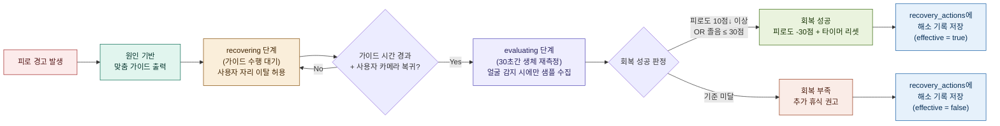

```
회복 검증 흐름:

1. recovering 단계
   - 가이드 중 최대 소요 시간(duration_sec)만큼 대기
   - 세션 시작 시 fatigue_before, drowsiness_before 기록
   - 사용자가 자리를 비워도(얼굴 미검출) 정상 동작
   - 시간 경과 + 얼굴 재감지 시 evaluating으로 전환

2. evaluating 단계
   - 30초간 생체 데이터 수집 (최소 10샘플)
   - 얼굴이 감지된 프레임에서만 샘플 수집 (미검출 프레임 제외)
   - 매 프레임: drowsiness_score, ear_value, mar_value 기록

3. 판정 (OR 조건으로 회복 성공)
   - 피로도가 세션 시작 대비 10점 이상 하락
   - 평균 졸음 점수가 30점 이하로 정상화

4. 후속 처리
   - 성공: apply_recovery() 실행 (피로 30점 감소 + 작업 타이머 리셋)
   - 실패: 추가 휴식 권고 메시지, 다음 5분 주기에 강한 가이드 재추천
   - 공통: recovery_actions 테이블에 before/after/effective 기록

회복 결과 데이터:
  - fatigue_before / fatigue_after / fatigue_drop
  - drowsiness_before / drowsiness_after / drowsiness_drop
  - avg_ear / avg_mar (평가 구간 평균)
  - eval_samples (수집된 샘플 수)
  - dominant_cause (주된 피로 원인)
  - effective (boolean) / reason (판정 사유)
```

### 5.5 개인화 회복 프로필 (RecoveryProfile)

DB에 축적된 회복 이력을 분석하여, 개인에게 효과적인 가이드를 우선 추천한다.

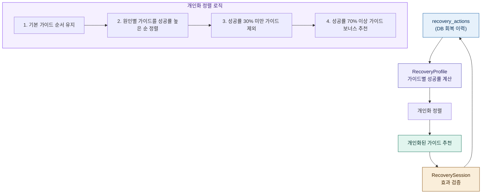

```
개인화 알고리즘:

1. 데이터 수집
   - recovery_actions 테이블에서 최근 100건 조회
   - 쉼표 구분된 guide_type을 개별 가이드로 분리
   - 각 가이드별 (성공 횟수 / 총 시도 횟수) = 성공률 계산

2. 개인화 적용 조건
   - 특정 가이드의 시도 횟수가 3회 이상이어야 개인화 적용
   - 3회 미만이면 기본 순서(0.5 기본 점수)로 중간 순위 배정

3. 가이드 정렬 규칙
   - 기본 가이드(base): 피로 단계에 따른 필수 가이드, 순서 변경 없음
   - 원인별 가이드: 성공률 높은 순으로 재정렬
   - 성공률 30% 미만: 해당 사용자에게 비효과적 → 추천 목록에서 제외
   - 성공률 70% 이상: 현재 추천 목록에 없더라도 보너스로 추가 추천

4. 프로필 갱신 시점
   - 시스템 시작 시 DB에서 초기 로드
   - 매 회복 세션 완료 후 즉시 갱신

예시 (사용자 A의 프로필):
  eye_rest:  8/10 = 80% → 우선 추천 + 보너스 대상
  breathing: 6/10 = 60% → 중간 순위
  caffeine:  1/5  = 20% → 제외 (이 사용자에게 비효과적)
  walk:      4/4  = 100% → 보너스 추천 (다른 원인에서도 추가)
```

### 5.6 로컬 LLM 기반 개인화 코칭 (LLMCoach)

정적 가이드(`guides.json`)만으로는 개인의 상황·맥락을 반영하기 어렵다는 한계가 있어, **데스크탑 전용**으로 Ollama 기반 로컬 LLM을 연동하여 피로 상태·원인·환경·회복 이력을 종합한 대화체 조언을 생성한다.

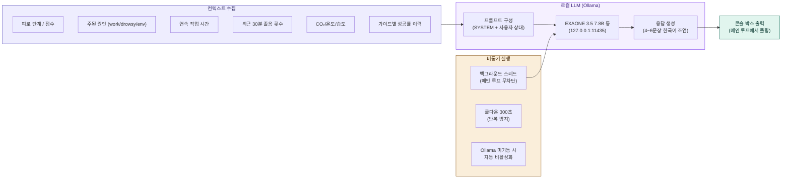

```
LLM 코칭 시스템 특징:

1. 로컬 실행 (프라이버시 + 오프라인 동작)
   - Ollama HTTP API (기본 127.0.0.1:11434, 본 프로젝트는 별도 인스턴스 :11435 사용) 사용
   - 외부 전송 없음 → 생체 데이터 보안 확보
   - 네트워크 없이도 동작

2. 비동기 처리 (실시간 성능 보장)
   - 별도 데몬 스레드에서 LLM 호출 (timeout 30초)
   - 메인 감지 루프(30fps)는 차단되지 않음
   - 응답은 매 루프에서 poll_result()로 수거

3. 컨텍스트 기반 개인화
   - 피로 단계·원인·작업시간·졸음 횟수·환경 수치
   - 과거 회복 이력 요약 (가이드별 N/M 성공률)
   - SYSTEM 프롬프트로 어조 일관성 유지
     ("4~6문장, 공감 먼저, 구체적 행동 1~2개 제안")

4. 장애 허용 (Graceful Fallback)
   - Ollama 서버 미가동 → 자동 비활성화, 정적 가이드만 사용
   - 모델 미설치 → 경고 후 비활성화
   - 응답 타임아웃 → 무시하고 다음 사이클 진행

5. 쿨다운 (콘솔 스팸 방지)
   - 마지막 요청으로부터 300초(5분) 경과 전 요청 무시
   - 기본 가이드 출력 쿨다운과 동일한 주기

사용 모델 (config.LLM_MODEL):
  - 기본 채택: exaone3.5:7.8b (LG AI연구원, 한국어 특화)
  - 대안 경량: gemma3:4b / qwen2.5:3b (RAM 4GB+)
  - 대안 균형: gemma2:9b / qwen2.5:7b (RAM 8GB+)
  - 데스크탑 전용이므로 RPi에서는 비활성화 (LLM_ENABLED = False)
```

#### 프롬프트 예시

```
SYSTEM: 당신은 사용자의 졸음과 피로를 실시간으로 관리하는 헬스 코치입니다.
얼굴 감지(EAR/MAR), 연속 작업 시간, 환경 센서(CO2/온도/습도),
과거 회복 이력을 참고해서 한국어로 간결하고 친근하게 조언합니다. ...

USER:
현재 피로 단계: 경고 (점수 78/100)
주된 피로 원인: 장시간 연속 작업
연속 작업 시간: 95분
최근 30분 졸음 감지 횟수: 7회
CO2: 1150ppm, 온도: 27°C, 습도: 55%
현재 권장 가이드: stretching, eye_rest, walk, hydration
과거 회복 효과 이력 요약: eye_rest=8/10, breathing=3/5, walk=4/4

위 상황에 맞는 개인화된 졸음 관리 조언을 작성해 주세요.
```

---

## 6. 웹 서버 (Django + Docker)

### 6.1 웹 서버 구성

| 컴포넌트 | 기술 | 역할 |
|----------|------|------|
| 웹 프레임워크 | Django 4.x (Docker, web) | 백엔드 API + HTML 대시보드 |
| 데이터베이스 | MySQL 8.0 (Docker, mysql) | 이력, 설정값 저장 |
| LLM 서버 | Ollama (별도 인스턴스, :11435) | 로컬 LLM 개인화 코칭 |
| AI 엔진 | Python `main.py` (호스트 직접 실행) | 졸음 감지 + 피로 관리 (웹캠 직접 접근) |
| 컨테이너 관리 | Docker Compose | 백엔드 서비스 통합 실행 |

### 6.2 데이터베이스 스키마

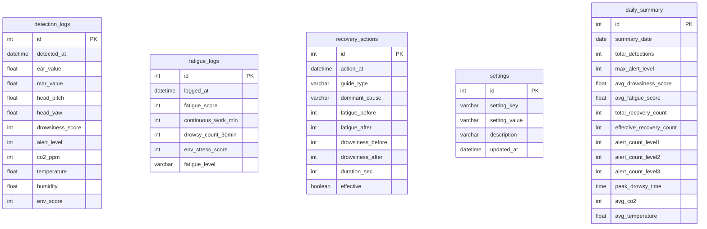

### 6.3 주요 Django API 엔드포인트

| 엔드포인트 | 메서드 | 설명 |
|------------|--------|------|
| `/` | GET | 메인 페이지 (실시간 대시보드) |
| `/api/logs/` | GET | 감지 이력 목록 (페이징, 날짜 필터) |
| `/api/fatigue/` | GET | 피로도 이력 (today/week/month) |
| `/api/recovery/` | GET | 피로 해소 기록 및 효과 통계 |
| `/api/environment/` | GET | 환경 센서 이력 (CO₂/온도/습도) |
| `/api/settings/` | GET/POST | 임계값, 가중치 설정 조회/변경 |
| `/api/daily_report/` | GET | 일간 요약 리포트 (집계 또는 실시간) |

### 6.4 웹 대시보드 기능

- **상태 카드**: 현재 피로도, 오늘 감지 횟수, 경고 횟수, 실내 환경 (CO₂/온습도)
- **졸음 점수 차트**: 최근 24시간 졸음 점수 추이 (경고 기준선 표시)
- **피로도 차트**: 오늘 피로도 변화 추이
- **환경 센서 차트**: CO₂, 온도, 습도 이중 축 그래프
- **감지 이력 테이블**: 최근 20건 상세 이력
- **피로 해소 기록 테이블**: 해소 시도 이력 및 효과 여부
- **자동 갱신**: 10초마다 대시보드 데이터 자동 새로고침

### 6.5 Python ↔ MySQL 연동 방식

```
[Python AI 엔진 (호스트)] --INSERT--> [MySQL (Docker)] --SELECT--> [Django API (Docker)] --JSON--> [웹 브라우저]
```

Python AI 엔진과 Django가 DB를 매개로 완전히 분리되어, 각각 독립적으로 개발·디버깅이 가능하다. 데스크탑 개발 환경에서 AI 엔진은 호스트에서 실행되어 웹캠/USB에 직접 접근하며, MySQL과 Django는 Docker Compose 네트워크 안에서 통신한다.

| 실행 위치 | DB 접속 | LLM 접속 |
|-----------|---------|----------|
| 호스트 (`main.py`) | `localhost:3307` | `http://127.0.0.1:11435` (별도 Ollama 인스턴스) |
| Docker 내부 (Django `web`) | `mysql:3306` | — |

---

## 7. 개발 단계

### 7.1 단계별 로드맵

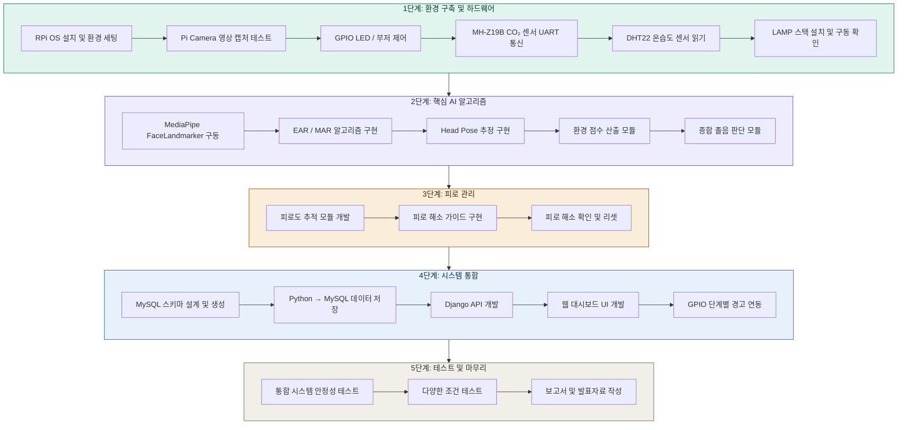

### 7.2 단계별 상세 내용

#### 1단계: 환경 구축 및 하드웨어 테스트

- Raspberry Pi OS 설치, Python 3.9+, OpenCV, MediaPipe 설치
- Pi Camera V2 연결 및 영상 캡처 테스트
- GPIO 핀으로 RGB LED, 부저 개별 제어 확인
- MH-Z19B CO₂ 센서 UART 통신 테스트
- DHT22 온습도 센서 데이터 읽기 테스트
- LAMP 스택 설치: Apache, MariaDB, PHP 설치 및 기본 동작 확인
- **마일스톤**: 카메라 영상 출력 + LED 점멸 + CO₂/온습도 값 콘솔 출력 + Apache 접속 확인

#### 2단계: 핵심 AI 알고리즘 구현

- MediaPipe FaceLandmarker Tasks API로 478개 랜드마크 추출
- EAR, MAR 계산 함수 구현 및 단위 테스트
- Head Pose Estimation (solvePnP) 구현
- 환경 점수 산출 모듈 개발 및 단위 테스트
- 종합 졸음 판단 모듈 개발 (가중 합산)
- **마일스톤**: 졸음 감지 + 환경 점수 반영 동작 확인

#### 3단계: 피로 관리

- 피로도 추적 모듈 개발 (연속 작업, 졸음 빈도, 환경 스트레스)
- 피로 해소 가이드 JSON 데이터 구성 및 콘솔 출력 구현
- 피로 해소 확인 및 피로도 부분 리셋 로직
- **마일스톤**: 졸음 반복 시 피로도 상승 + 가이드 자동 제공

#### 4단계: 시스템 통합

- MySQL 스키마 설계 및 전체 테이블 생성
- Python → MySQL 데이터 저장 모듈 개발 (주기적 저장)
- Django REST API 개발 (이력, 피로도, 해소 기록, 환경, 설정, 일간 리포트)
- Chart.js 기반 웹 대시보드 UI 개발 (Django Template)
- GPIO 단계별 경고 연동
- **마일스톤**: 전체 파이프라인 동작 (감지 → 판단 → 경고 → DB → 웹 조회)

#### 5단계: 테스트 및 마무리

- 통합 시스템 안정성 테스트 (장시간 연속 가동)
- 다양한 조건 테스트: 안경 착용, 어두운 환경, 다양한 각도
- 피로 해소 가이드 효과 검증 (가이드 전후 졸음 점수 비교)
- 프로젝트 보고서 작성 및 발표 준비
- **마일스톤**: 라이브 데모 가능한 완성 시스템

---

## 8. 개발 전략

### 8.1 데스크탑 선행 개발 → RPi 이식

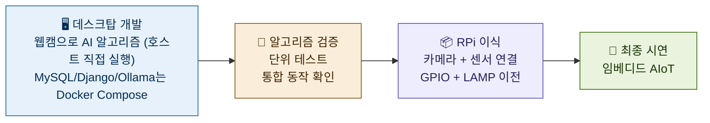

- 코어 AI 로직은 데스크탑(Windows 호스트)에서 웹캠으로 먼저 개발 — `python main.py`
- 환경 센서는 데스크탑에서 더미 데이터로 테스트 후 RPi에서 실제 연결
- Django 웹·MySQL·Ollama는 Docker Compose로 병행 실행 (`docker compose up -d`)
- 카메라 입력부, GPIO, 센서 통신부만 RPi에서 조정

### 8.2 Python ↔ Django 분리 아키텍처의 장점

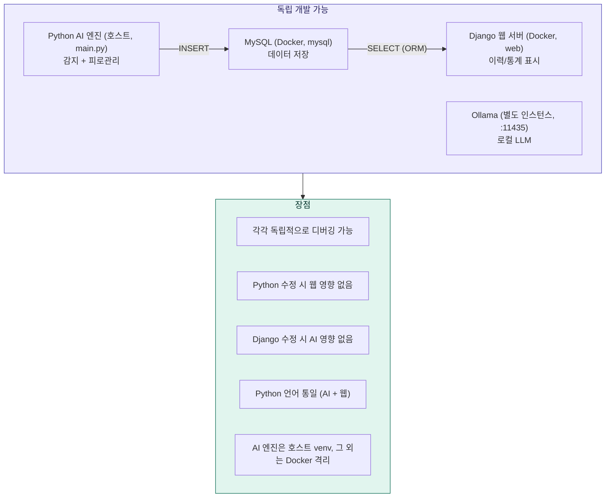

---

## 9. 프로젝트 디렉토리 구조

```
capstone_project/
├── main.py                    # 메인 실행 파일 (AI 엔진)
├── config.py                  # 설정값 (가중치, GPIO 핀, DB 접속정보)
├── requirements.txt           # Python 패키지 목록
│
├── modules/
│   ├── camera.py              # 카메라 캡처 모듈
│   ├── face_detector.py       # MediaPipe FaceLandmarker (478개 랜드마크)
│   ├── drowsiness.py          # EAR / MAR 계산 + PERCLOS 추적 + 졸음 상태 추적
│   ├── head_pose.py           # 고개 기울기 추정 (solvePnP, 초기값 재활용)
│   ├── env_sensor.py          # CO₂ (MH-Z19B) + 온습도 (DHT22) + 센서 캐싱
│   ├── judge.py               # 종합 졸음 판단 (가중 합산 + EMA 스무딩)
│   ├── fatigue_manager.py     # 피로도 추적 + 해소 가이드 추천
│   ├── recovery_guide.py      # 피로 해소 가이드 데이터 및 출력 (정적)
│   ├── llm_coach.py           # 로컬 LLM(Ollama) 개인화 코칭 (비동기, 데스크탑 전용)
│   ├── alert.py               # GPIO 경고 출력 제어 (LED + 부저)
│   └── db_writer.py           # MySQL 데이터 저장
│
├── data/
│   └── guides.json            # 피로 해소 가이드 데이터 (JSON)
│
├── models/
│   └── face_landmarker.task   # MediaPipe FaceLandmarker 모델 파일
│
├── web/                       # Django 웹 서버 (Docker · :8000)
│   ├── Dockerfile             # Django 컨테이너 이미지
│   ├── requirements.txt       # django, pymysql
│   ├── manage.py
│   ├── capstone_web/          # Django 프로젝트 설정
│   │   ├── settings.py        # DB·정적파일 설정 (환경변수 기반)
│   │   └── urls.py
│   └── dashboard/             # Django 앱
│       ├── models.py          # DB 모델 (managed=False, 기존 스키마 재사용)
│       ├── views.py           # REST API + 대시보드 뷰
│       ├── urls.py            # /api/logs/, /api/fatigue/ 등
│       ├── templates/dashboard/index.html  # 실시간 대시보드
│       └── static/
│           ├── js/main.js     # 대시보드 로직 (API 경로 Django 형식)
│           ├── js/chart_config.js  # Chart.js 설정
│           └── css/style.css  # 대시보드 스타일
│
├── sql/
│   └── schema.sql             # MySQL 테이블 생성 스크립트
│
├── tests/
│   ├── test_ear.py            # EAR 알고리즘 단위 테스트
│   ├── test_mar.py            # MAR 알고리즘 단위 테스트
│   ├── test_fatigue.py        # 피로도 관리 단위 테스트
│   ├── test_env_sensor.py     # 환경 점수 산출 테스트
│   └── test_gpio.py           # GPIO 동작 테스트
│
└── docs/
    └── wiring_diagram.md      # 배선도
```

---

## 10. 참고 기술 및 라이브러리

### 10.1 AI / 임베디드 (Python)

| 기술 | 버전 | 용도 |
|------|------|------|
| Python | 3.9+ | 메인 AI 엔진 개발 언어 |
| OpenCV | 4.8+ | 영상 처리, solvePnP |
| MediaPipe | 0.10+ | FaceLandmarker Tasks API (얼굴 랜드마크) |
| RPi.GPIO | 0.7+ | GPIO 핀 제어 (LED, 부저) |
| pymysql | 1.1+ | Python → MySQL 데이터 저장 |
| pyserial | 3.5+ | MH-Z19B UART 통신 |
| Adafruit_DHT | 1.4+ | DHT22 센서 읽기 |
| NumPy | 1.24+ | 수치 계산 |
| Ollama | 0.3+ | 로컬 LLM 런타임 (데스크탑 전용, 개인화 코칭) |
| EXAONE 3.5 / Gemma / Qwen | 4B~9B | 한국어 대응 LLM (기본: exaone3.5:7.8b) |

### 10.2 웹 서버 (Django + Docker)

| 기술 | 버전 | 용도 |
|------|------|------|
| Django | 4.2+ | 웹 프레임워크 (API + 대시보드) |
| MySQL | 8.0 (Docker) | 관계형 데이터베이스 |
| Docker Compose | 2.x | 전체 서비스 컨테이너 관리 |
| uv | 최신 | Python 패키지 설치 (pip 대비 고속) |
| Chart.js | 4.x | 통계/추이 그래프 시각화 |
| chartjs-plugin-annotation | 3.x | 차트 기준선 표시 |

---

## 11. 예상 성과 및 확장 가능성

### 예상 성과
- 졸음 감지 정확도: 90% 이상 (다중 센서 융합)
- 실시간 처리 속도: 10\~15fps (RPi 4 기준)
- 경고 응답 시간: 졸음 감지 후 1초 이내
- 피로 해소 가이드 효과: 가이드 제공 후 졸음 점수 20% 이상 감소 목표
- LLM 코칭 응답 지연: 2~8초 (데스크탑, 로컬 실행 / 메인 루프 무차단)

### 향후 확장
- **개인화 시스템**: 캘리브레이션을 통한 개인별 baseline 측정 및 비율 기반 졸음 판단 (고정 임계값 → 개인 맞춤 임계값)
- **패턴 학습**: 시간대별 졸음 패턴 분석, 피로 해소법 효과 분석, 환경 민감도 학습
- **다중 사용자 프로필**: user_profiles 테이블 기반 다중 사용자 지원
- 스마트폰 실시간 모니터링 (MJPEG 스트리밍 + AJAX 대시보드)
- 스마트워치 연동 (심박수, GSR 데이터 추가)
- 소형 팬, 진동 모터 등 추가 경고/각성 장치 확장
- TFLite 경량 모델 학습 (개인별 졸음/피로 패턴 딥러닝)
- 다중 사용자 동시 감지 (교실, 사무실 환경)
- 차량 환경 적용 (OBD-II 연동, CAN 통신)
