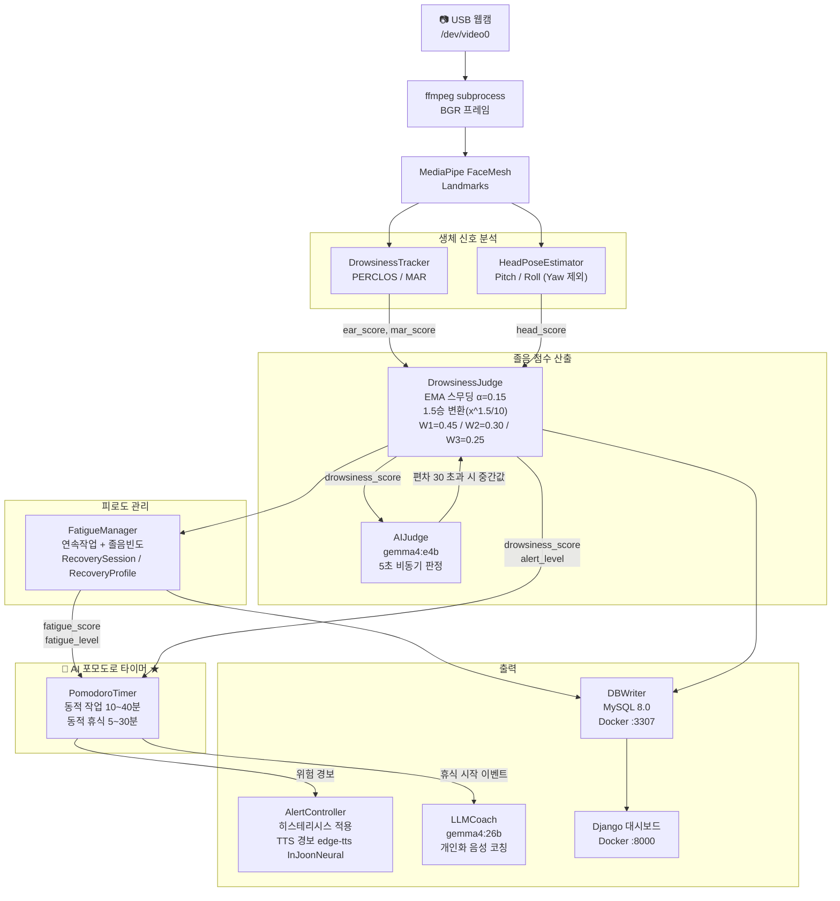

# AI 개인 맞춤형 포모도로 타이머

## 1. 프로젝트 개요

| 항목 | 내용 |
|------|------|
| 프로젝트명 | AI 개인 맞춤형 포모도로 타이머 |
| 전공 | 임베디드 소프트웨어 |
| 핵심 기술 | MediaPipe, OpenCV, Ollama(로컬 LLM), MeloTTS, Django, Docker, WSL2 |

USB 웹캠으로 얼굴을 실시간 분석하여 사용자의 피로도·졸음 상태를 측정하고, 이를 기반으로 **작업 인터벌과 휴식 시간을 동적으로 조정**하는 AI 포모도로 타이머. 고정된 25/5분 방식이 아닌, 지금 내 상태에 맞는 인터벌을 로컬 LLM이 판단한다. 휴식 종류도 누적된 개인 회복 이력에 따라 맞춤 추천하며, TTS 음성 코칭으로 자연스럽게 안내한다.

---

## 2. 시스템 아키텍처



### 실행 환경

| 구성 요소 | 실행 위치 | 접속 |
|----------|-----------|------|
| `main.py` (AI 엔진) | WSL2 호스트 직접 실행 | — |
| MySQL 8.0 | Docker (`mysql`) | `localhost:3307` |
| Django 대시보드 | Docker (`web`) | `http://localhost:8000` |
| Ollama LLM 서버 | WSL2 호스트 직접 실행 | `http://127.0.0.1:11434` |

### 실행 방법

```bash
# 한 번에 실행 (usbipd attach → Docker → Ollama → main.py)
~/capstone/run.sh

# Windows에서 더블클릭
\\wsl$\Ubuntu\home\parkjiho\capstone\run_windows.bat
```

---

## 3. 핵심 알고리즘

### 3.1 EAR → PERCLOS (눈 감김 비율)

```
EAR = (|P2-P6| + |P3-P5|) / (2 × |P1-P4|)

임계값: EAR < 0.20 → 해당 프레임을 "눈 감김"으로 기록

PERCLOS (Percentage of Eye Closure, 최근 60초 윈도우):
  PERCLOS(%) = 눈 감김 시간 / 전체 관측 시간 × 100
  ※ 워밍업: 데이터 축적 20초 미만이면 0점 (오탐 방지)

PERCLOS 점수 (선형 보간):
   0 ~ 10% →   0점  (정상 깜빡임 + 데드존)
  10 ~ 20% →   0~20점
  20 ~ 30% →  20~45점
  30 ~ 45% →  45~70점
  45 ~ 55% →  70~85점
  55 ~ 65% →  85~100점
```

### 3.2 MAR (Mouth Aspect Ratio)

```
MAR = (세로 거리 합) / (2 × 가로 거리)

임계값: MAR > 0.75 → 하품 판정
지속시간 요건: 0.8초 이상 초과 상태 유지 시만 카운트 (순간 오탐 방지)

MAR 점수 (선형 보간, 3분 슬라이딩 윈도우):
  1회 →  5점
  2회 → 20점
  3회 → 40점
  5회 → 70점
  7회 → 100점
```

### 3.3 Head Pose 점수

OpenCV `solvePnP`로 Pitch(상하), Roll(기울기) 추정.
**Yaw(좌우 돌림)는 졸음 징후가 아니므로 제외.**

```
Pitch 점수 (고개 숙임 — 핵심 지표, 데드존 15°):
  0~15°  →  0점
  20°    → 10점
  28°    → 30점
  38°    → 60점
  65°    → 100점

Roll 점수 (옆으로 기울어짐 — 수면 징후, 데드존 12°):
  0~12°  →  0점
  22°    → 10점
  32°    → 25점
  48°    → 40점

head_score = pitch_score + roll_score  (최대 100)
```

### 3.4 종합 졸음 점수

```
raw = W1×EAR + W2×MAR + W3×Head
  W1 = 0.45 (눈 감김)
  W2 = 0.30 (하품)
  W3 = 0.25 (고개 기울기)

1.5승 변환 (제곱보다 이른 감지, 선형보다 오경보 억제):
  score_curved = raw^1.5 / 10

EMA 스무딩 (α = 0.15, 급격한 변화 방지):
  drowsiness_score = α × score_curved + (1-α) × prev

경고 단계:
   0 ~ 40 → 정상 (L0)
  41 ~ 70 → 주의 (L1)  ← TTS "주의! 졸음이 감지됩니다."
  71 ~ 85 → 경고 (L2)  ← TTS "경고! 졸음 수준이 높습니다."
  86 ~100 → 위험 (L3)  ← TTS "위험! 즉시 작업을 멈추세요."

히스테리시스 (레벨 하강 시 적용, 진동 방지):
  L1→L0: 점수 < 30 이어야 복귀
  L2→L1: 점수 < 58 이어야 복귀
  L3→L2: 점수 < 75 이어야 복귀
```

> AI 판정(gemma4:e4b, 5초 주기): 규칙 기반 점수와 편차 30 초과 시 중간값 적용

---

## 4. 피로도 관리

### 4.1 누적 피로도 점수

```
피로도 = F1×연속작업 점수 + F2×졸음빈도 점수
  F1 = 0.40 (연속 작업 시간)
  F2 = 0.60 (졸음 감지 빈도)

연속작업 점수 (선형 보간):
  30분 → 0점, 60분 → 20점, 90분 → 50점, 120분 → 80점

졸음빈도 점수 (최근 30분, alert_level ≥ 2일 때 30초마다 기록):
  3회 → 10점, 10회 → 40점, 20회 → 65점, 40회 → 100점

피로 단계:
   0 ~ 50 → 양호
  51 ~ 75 → 주의
  76 ~ 88 → 경고
  89 ~100 → 위험
```

### 4.2 원인 기반 맞춤 가이드

피로의 주된 원인(연속작업 / 졸음빈도)을 분석하여 단계별 가이드 추천.
5분마다 콘솔 출력 후 LLM 코칭 비동기 요청.

| 피로 단계 | 기본 가이드 | + 연속작업 | + 졸음 빈도 |
|-----------|------------|-----------|------------|
| 주의 | 눈 피로 해소 | 자세 교정, 수분 보충 | 냉수 세안, 호흡법 |
| 경고 | 스트레칭, 눈 피로 해소 | 산책, 수분 보충, 자세 교정 | 냉수 세안, 호흡법, 카페인 |
| 위험 | 즉시 휴식, 스트레칭, 눈 피로 해소 | 산책, 수분 보충 | 냉수 세안, 카페인, 호흡법 |

### 4.3 시간대별 피로 패턴 학습

DB `fatigue_logs`에서 시간대별 평균 피로도를 집계해 포모도로 인터벌에 선제 반영.
- 해당 시간대 과거 피로 평균 ≥ 75 → 작업 인터벌 -5분
- 해당 시간대 과거 피로 평균 ≥ 50 → 작업 인터벌 -3분
- 각 시간대 최소 3샘플 이상 쌓여야 적용

### 4.4 개인 최적 작업 인터벌 학습

과거 경고/위험 단계 진입 시점의 평균 연속 작업 시간을 역산하여 다음 포모도로 기준 인터벌로 사용.
- 공식: 개인 기준 = 피로 임계 도달 평균 시간 × 0.85
- DB 5회 이상 기록 후 활성화

---

## 5. LLM 코칭 (LLMCoach)

```
모델: gemma4:26b (Ollama, 로컬 실행)
쿨다운: 5분 (300초)
타임아웃: 180초

입력 컨텍스트:
  - 피로 단계 / 점수
  - 주된 원인 (work / drowsy)
  - 연속 작업 시간, 30분 졸음 횟수
  - 추천 가이드 목록
  - 추천 가이드 유형 (피로 단계·원인 기반)

출력: 3~4문장 자연스러운 한국어 대화체
TTS: MeloTTS (로컬 AI, ko 모델)
```

---

## 6. AI 졸음 판정 (AIJudge)

```
모델: gemma4:e4b (Ollama, 로컬 실행)
주기: 5초 비동기
출력 형식: {"drowsiness": 0~100, "level": 0~3}

규칙 기반 점수를 앵커로 전달 (±25 이내 판정 유도)
편차 30 초과 시: 최종값 = (규칙 기반 + AI 판정) / 2

옵션:
  temperature: 0.1
  num_predict: 80
  repeat_penalty: 1.8
```

---

## 7. 웹 서버 (Django + Docker)

### 7.1 DB 스키마

```
detection_logs   : ear, mar, pitch, yaw, drowsiness_score, alert_level
fatigue_logs     : fatigue_score, continuous_work_min, drowsy_count, fatigue_level
recovery_actions : guide_type, dominant_cause, fatigue/drowsiness before/after, effective
settings         : 설정 키-값
daily_summary    : 일간 집계 통계
```

### 7.2 페이지 구성

| URL | 설명 |
|-----|------|
| `/` | 메인 대시보드 (날짜 선택, 이력 조회, 페이지네이션) |
| `/realtime/` | 실시간 대시보드 (1초 폴링, 졸음 게이지, 포모도로) |
| `/settings/` | 감지 설정 (EAR/MAR 임계값, 가중치 조정) |

### 7.3 주요 API

| 엔드포인트 | 설명 |
|------------|------|
| `/api/realtime/` | main.py 실시간 상태 (1초 갱신, stale 감지) |
| `/api/logs/` | 감지 이력 (날짜 필터, 페이지네이션) |
| `/api/fatigue/` | 피로도 이력 (날짜 필터) |
| `/api/recovery/` | 회복 기록 및 효과 통계 |
| `/api/settings/` | 설정 조회/변경 |
| `/api/daily_report/` | 일간 요약 |

---

## 8. 파일 구조

```
capstone/
├── main.py                  # 메인 실행 파일
├── config.py                # 전체 설정값
├── run.sh                   # 한 번에 실행 (usbipd + Docker + Ollama + main.py)
├── run_windows.bat          # Windows 더블클릭 실행
│
├── modules/
│   ├── camera.py            # ffmpeg subprocess 카메라 캡처
│   ├── face_detector.py     # MediaPipe FaceMesh
│   ├── drowsiness.py        # EAR / MAR / PERCLOS 계산 (개인 임계값 지원)
│   ├── calibration.py       # 세션 초반 EAR/MAR 개인 기준값 자동 캘리브레이션
│   ├── head_pose.py         # 고개 기울기 추정 (Pitch/Roll, Yaw 제외)
│   ├── judge.py             # 종합 졸음 점수 (EMA + 1.5승 변환)
│   ├── ai_judge.py          # gemma4:e4b 비동기 판정
│   ├── fatigue_manager.py   # 피로도 추적 + 가이드 추천
│   ├── recovery_guide.py    # 가이드 데이터 출력
│   ├── llm_coach.py         # gemma4:26b 개인화 코칭
│   ├── alert.py             # 경고 단계 제어 + 히스테리시스 + TTS 연동
│   ├── voice.py             # MeloTTS + WSL2 PowerShell 오디오 브릿지
│   └── db_writer.py         # MySQL 데이터 저장 / 시간대별 패턴 조회
│
├── data/
│   └── guides.json          # 피로 해소 가이드 데이터
│
├── web/                     # Django (Docker :8000)
├── sql/
│   └── schema.sql           # DB 테이블 생성 스크립트
└── tests/                   # 단위 테스트
```

---

## 9. 기술 스택

| 분류 | 기술 |
|------|------|
| 얼굴 분석 | MediaPipe FaceMesh, OpenCV |
| AI 판정 | Ollama + gemma4:e4b |
| LLM 코칭 | Ollama + gemma4:26b |
| TTS | MeloTTS (로컬 AI, ko 모델) |
| 웹 | Django 4.x, MySQL 8.0, Chart.js |
| 인프라 | Docker Compose, WSL2 Ubuntu 24.04 |
| 카메라 | USB 2.0 Camera (usbipd + /dev/video0) |
