# AIoT 기반 졸음 및 집중력 저하 방지 시스템

## 1. 프로젝트 개요

| 항목 | 내용 |
|------|------|
| 프로젝트명 | AIoT 기반 졸음 및 집중력 저하 방지 시스템 |
| 전공 | 임베디드 소프트웨어 |
| 개발 인원 | 1인 |
| 핵심 기술 | Raspberry Pi, MediaPipe, OpenCV, LAMP Stack, GPIO |

본 프로젝트는 Raspberry Pi에 카메라와 환경 센서를 연결하여 사용자의 얼굴을 실시간으로 분석하고, AI 기반 졸음 및 집중력 저하를 감지하여 단계적 경고를 출력하는 임베디드 AIoT 시스템이다. 최초 캘리브레이션을 통해 사용자별 기준값을 설정하고, 고정 임계값이 아닌 개인 기준 대비 변화율로 졸음을 판단하여 사람마다 다른 신체 특성에 대응한다. 사용 이력을 분석하여 시간대별 졸음 패턴과 효과적인 피로 해소법을 학습하며, 쓸수록 정확도가 향상되는 개인 맞춤형 시스템이다. LAMP 스택 기반 웹 서버를 통해 감지 이력, 피로도 리포트 및 개인 패턴 분석 결과를 제공한다.

### 1.1 목적

현대 사회에서 장시간 학습, 업무, 운전 등으로 인한 졸음과 집중력 저하는 학습 효율 감소, 업무 생산성 하락, 교통사고 등 심각한 문제를 유발한다. 기존의 졸음 감지 시스템은 고정된 임계값을 사용하여 개인차를 반영하지 못하고, 단순히 경고만 울릴 뿐 근본적인 피로 관리를 제공하지 못한다는 한계가 있다.

본 프로젝트의 목적은 다음과 같다.

1. **개인 맞춤형 졸음 감지**: 사람마다 다른 눈 크기, 하품 빈도, 환경 민감도를 캘리브레이션과 패턴 학습을 통해 반영하여 오탐과 미탐을 최소화한다.
2. **다중 센서 융합 분석**: 카메라 영상(EAR, MAR, Head Pose)과 환경 센서(CO₂, 온도, 습도)를 종합적으로 분석하여 단일 센서 대비 높은 감지 정확도를 달성한다.
3. **능동적 피로 관리**: 졸음을 감지하는 것에 그치지 않고, 누적 피로도를 추적하고 개인별로 효과적인 피로 해소 가이드(스트레칭, 호흡법, 환기 권고 등)를 제공하여 근본적인 집중력 유지를 돕는다.
4. **사용할수록 정확해지는 학습 시스템**: 시간대별 졸음 패턴, 피로 해소법 효과, 환경 민감도를 지속적으로 학습하여 사용 기간이 길어질수록 개인에게 최적화된 서비스를 제공한다.
5. **엣지 AI 기반 임베디드 시스템 구현**: 클라우드에 의존하지 않고 Raspberry Pi 단독으로 AI 추론, 센서 제어, 웹 서버를 운영하여 네트워크 없이도 동작하는 자립형 시스템을 구현한다.

---

## 2. 시스템 구성도

### 2.1 전체 시스템 아키텍처

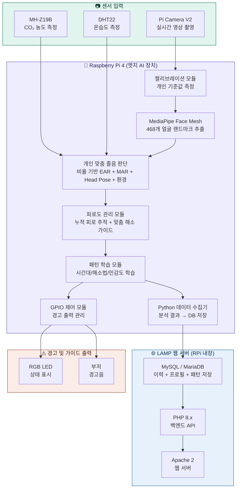

### 2.2 개인화 시스템 흐름

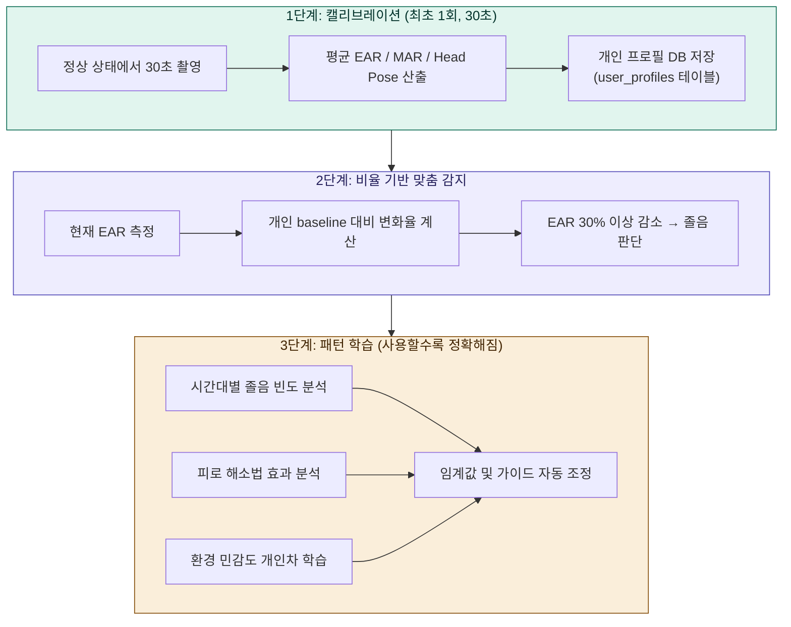

### 2.3 LAMP 스택 데이터 흐름

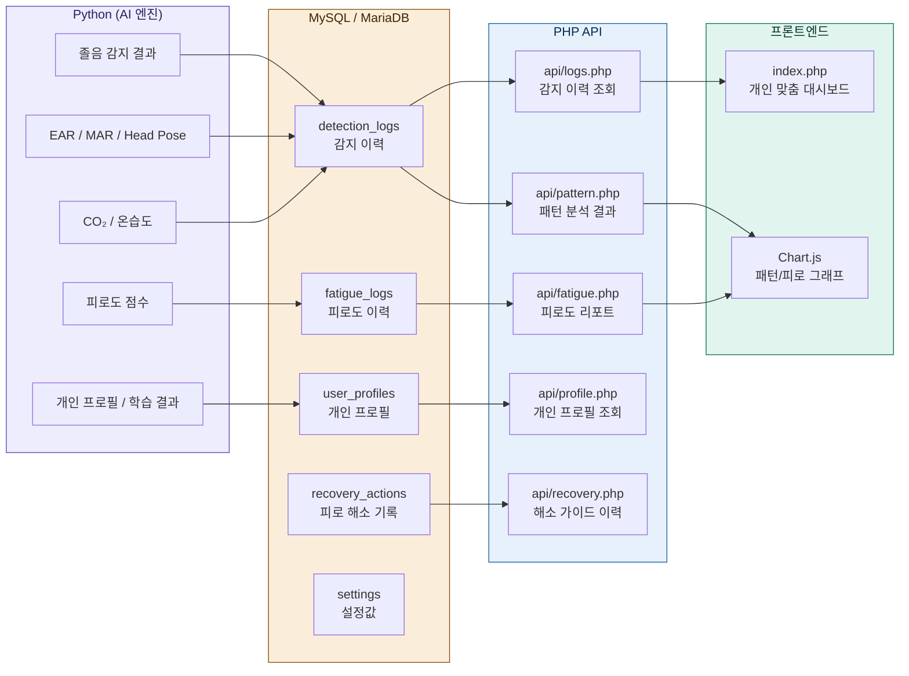

### 2.4 소프트웨어 모듈 구조

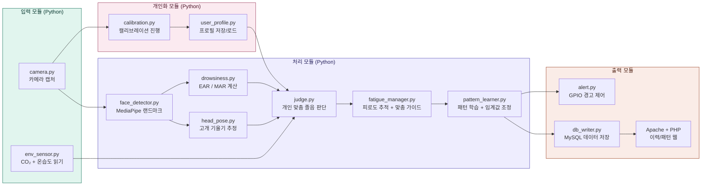

---

## 3. 하드웨어 구성

### 3.1 부품 목록

| 부품 | 모델 | 용도 |
|------|------|------|
| 메인 보드 | Raspberry Pi 4 (4GB) | 엣지 AI 처리 + LAMP 서버 |
| 카메라 | Pi Camera V2 | 얼굴 영상 촬영 |
| CO₂ 센서 | MH-Z19B | 이산화탄소 농도 측정 |
| 온습도 센서 | DHT22 | 실내 온도/습도 측정 |
| RGB LED | 공통 캐소드 | 상태 표시 (녹/황/적) |
| 부저 | 능동 부저 | 경고음 출력 |
| 기타 | 점퍼선, 브레드보드, 거치대 | 조립 및 고정 |

### 3.2 GPIO 핀 배치

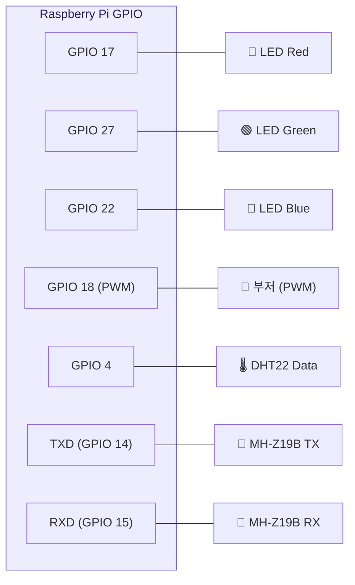

### 3.3 환경 센서 사양

| 센서 | 측정 범위 | 정확도 | 통신 방식 | 졸음 임계값 |
|------|-----------|--------|-----------|-------------|
| MH-Z19B (CO₂) | 0\~5000ppm | ±50ppm | UART (9600bps) | 1000ppm 이상 → 집중력 저하 |
| DHT22 (온습도) | -40\~80°C / 0\~100%RH | ±0.5°C / ±2%RH | 디지털 1-Wire | 26°C 이상 → 졸음 유발 |

---

## 4. 개인화 시스템

### 4.1 캘리브레이션 (최초 1회)

프로그램 최초 실행 시 또는 새로운 사용자 등록 시, 30초간 정상 상태를 측정하여 개인 기준값(baseline)을 산출한다.

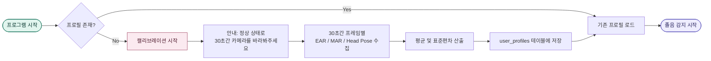

#### 캘리브레이션 수집 항목

```
30초간 수집 (약 300~450 프레임):
  - EAR 평균 / 표준편차
  - MAR 평균 / 표준편차
  - Head Pitch 평균 / 표준편차
  - Head Yaw 평균 / 표준편차

이상치 제거:
  - 눈 깜빡임 프레임 자동 제외 (EAR이 급격히 떨어지는 프레임)
  - 고개를 돌린 프레임 자동 제외 (Yaw 급변 프레임)
```

### 4.2 비율 기반 졸음 판단

고정 임계값 대신, 캘리브레이션에서 측정한 개인 기준값 대비 변화율로 졸음을 판단한다.

```
변경 전 (고정 임계값):
  EAR < 0.2 → 졸음

변경 후 (비율 기반):
  EAR < baseline_ear × ear_threshold_ratio → 졸음

예시:
  A씨 (눈 작음): baseline_ear = 0.24, ratio = 0.7
    → 0.24 × 0.7 = 0.168 이하이면 졸음

  B씨 (눈 큼):   baseline_ear = 0.35, ratio = 0.7
    → 0.35 × 0.7 = 0.245 이하이면 졸음

MAR도 동일한 방식:
  MAR > baseline_mar × mar_threshold_ratio → 하품
  기본 ratio = 1.5 (baseline 대비 1.5배 이상 벌어지면 하품)

Head Pose도 동일:
  |current_pitch - baseline_pitch| > pitch_threshold → 고개 숙임
  기본 pitch_threshold = 15° (baseline 대비 15도 이상 숙이면 감지)
```

### 4.3 패턴 학습

사용 데이터가 쌓이면 다음 3가지를 자동으로 학습한다.

#### 시간대별 졸음 패턴

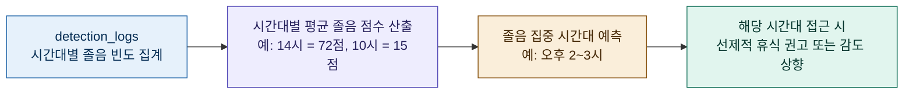

```
SQL 예시:
SELECT HOUR(detected_at) AS hour, AVG(drowsiness_score) AS avg_score
FROM detection_logs
WHERE user_id = ?
GROUP BY HOUR(detected_at)
ORDER BY avg_score DESC;

결과 예시:
  14시: 평균 72점 → peak_drowsy_hour = 14
  15시: 평균 65점
  10시: 평균 15점
```

#### 피로 해소법 효과 분석

```
SQL 예시:
SELECT guide_type,
       COUNT(*) AS total,
       SUM(effective) AS effective_count,
       AVG(fatigue_before - fatigue_after) AS avg_reduction
FROM recovery_actions
WHERE user_id = ?
GROUP BY guide_type
ORDER BY avg_reduction DESC;

결과 예시:
  호흡법:     효과율 80%, 평균 피로도 25점 감소 → 1순위 추천
  스트레칭:   효과율 65%, 평균 피로도 18점 감소 → 2순위 추천
  눈 운동:    효과율 50%, 평균 피로도 12점 감소 → 3순위 추천
```

학습 결과는 `user_profiles.best_recovery_type`에 저장하고, 피로 해소 가이드 제공 시 해당 사용자에게 효과적인 방법을 우선 추천한다.

#### 환경 민감도 학습

```
사람마다 CO₂에 대한 민감도가 다르다.
- A씨: CO₂ 900ppm부터 졸음 점수 상승 → 환경 임계값을 900ppm으로 하향
- B씨: CO₂ 1200ppm까지도 영향 없음   → 환경 임계값을 1200ppm으로 상향

학습 방법:
  CO₂ 구간별 졸음 점수 상관관계 분석
  상관계수가 유의미하게 상승하기 시작하는 CO₂ 구간을 개인 임계값으로 설정

동일한 방식으로 온도/습도 민감도도 학습
```

### 4.4 임계값 자동 조정 (피드백 기반)

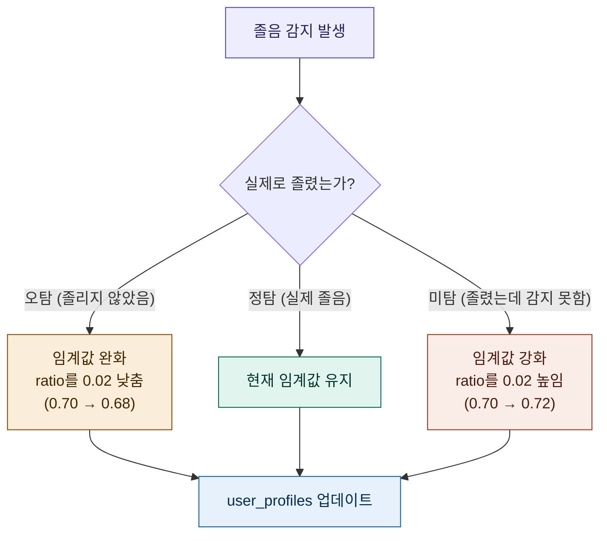

오탐/미탐 판단 방법:
- **오탐 판단**: 경고 발생 후 5초 이내에 EAR/MAR이 정상 범위로 복귀하면 오탐으로 간주
- **미탐 판단**: 경고 없이 연속 3분 이상 EAR이 baseline 대비 20~29% 감소 상태가 지속되면, 임계값이 너무 느슨한 것으로 간주
- 조정 범위 제한: ratio는 0.60~0.85 범위 내에서만 변동 (과도한 조정 방지)

---

## 5. 핵심 알고리즘

### 5.1 졸음 감지 흐름

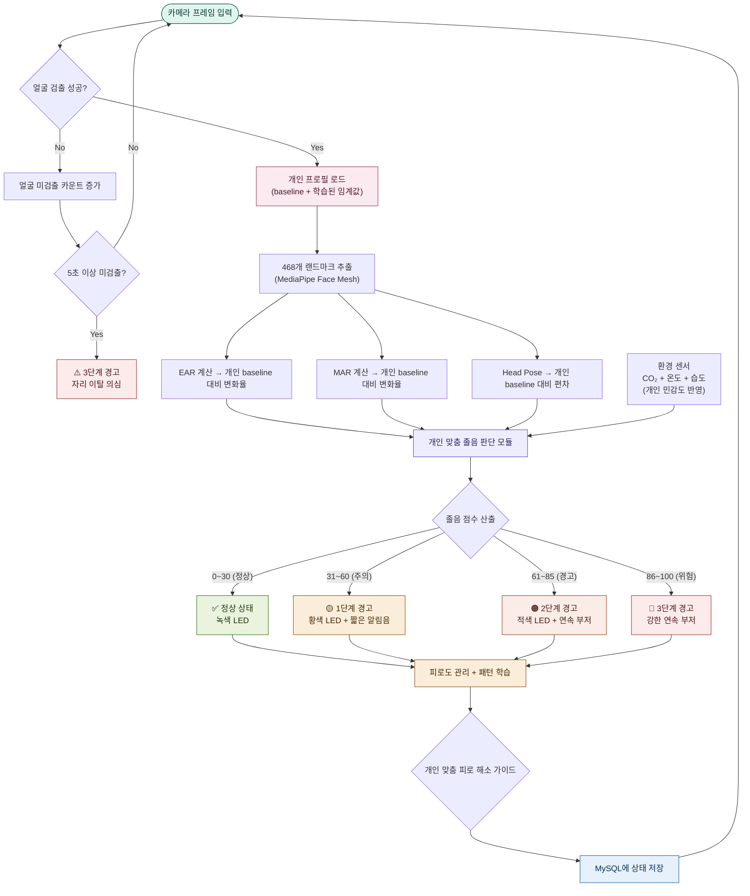

### 5.2 EAR (Eye Aspect Ratio) 계산

눈의 세로 길이 대비 가로 길이 비율로, 눈을 감으면 값이 급격히 감소한다.

```
EAR = (|P2 - P6| + |P3 - P5|) / (2 × |P1 - P4|)

- P1, P4: 눈의 좌우 끝점 (가로)
- P2, P3: 눈의 상단 점 (세로)
- P5, P6: 눈의 하단 점 (세로)

판정 (개인화):
  EAR < baseline_ear × ear_threshold_ratio → 눈 감김 판정
  지속 시간: 2초 이상 연속 감김 → 졸음 판정
```

### 5.3 MAR (Mouth Aspect Ratio) 계산

입의 벌어진 정도를 측정하여 하품을 감지한다.

```
MAR = (|P2 - P6| + |P3 - P5|) / (2 × |P1 - P4|)

판정 (개인화):
  MAR > baseline_mar × mar_threshold_ratio → 하품 판정
  빈도: 3분 내 3회 이상 하품 → 졸음 전조
```

### 5.4 종합 졸음 점수 산출

```
졸음 점수 = (W1 × EAR 점수) + (W2 × MAR 점수) + (W3 × Head Pose 점수) + (W4 × 환경 점수)

가중치 (기본값, 학습에 의해 개인별 조정 가능):
  W1 = 0.35  (눈 감김)
  W2 = 0.25  (하품 빈도)
  W3 = 0.20  (고개 기울기)
  W4 = 0.20  (환경 — 개인 민감도 반영)

점수 범위: 0 (완전 각성) ~ 100 (완전 졸음)
```

### 5.5 환경 점수 산출

```
환경 점수 = (E1 × CO₂ 점수) + (E2 × 온도 점수) + (E3 × 습도 점수)

가중치:
  E1 = 0.50  (CO₂)
  E2 = 0.30  (온도)
  E3 = 0.20  (습도)

CO₂ 점수 (기본값, 개인 민감도 학습에 의해 조정 가능):
  400~800ppm   → 0점 (쾌적)
  800~1000ppm  → 30점 (보통)
  1000~1500ppm → 60점 (나쁨, 환기 필요)
  1500ppm 이상 → 100점 (매우 나쁨)

온도 점수:
  18~24°C → 0점 (쾌적)
  24~26°C → 40점 (약간 높음)
  26~28°C → 70점 (졸음 유발)
  28°C 이상 → 100점 (매우 높음)

습도 점수:
  40~60%RH → 0점 (쾌적)
  60~70%RH → 40점 (약간 높음)
  70%RH 이상 → 80점 (불쾌)
```

---

## 6. 피로도 관리 시스템

### 6.1 피로도 관리 흐름

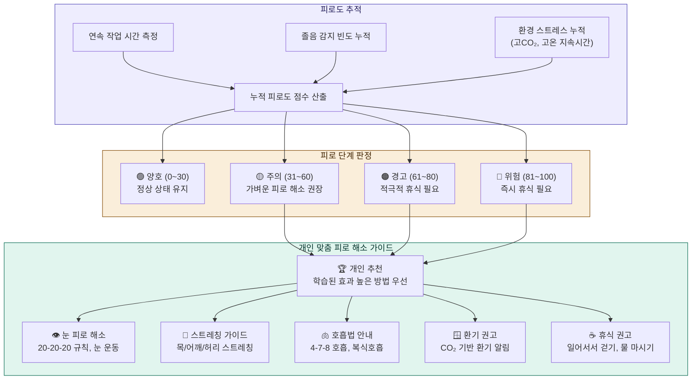

### 6.2 누적 피로도 점수 산출

```
피로도 = (F1 × 연속작업 점수) + (F2 × 졸음빈도 점수) + (F3 × 환경스트레스 점수)

가중치:
  F1 = 0.35  (연속 작업 시간)
  F2 = 0.40  (졸음 감지 빈도)
  F3 = 0.25  (환경 스트레스 누적)

연속작업 점수:
  0~30분    → 0점
  30~60분   → 20점
  60~90분   → 50점
  90~120분  → 80점
  120분 이상 → 100점

졸음빈도 점수 (최근 30분 기준):
  0회     → 0점
  1~2회   → 30점
  3~5회   → 60점
  6회 이상 → 100점

환경스트레스 점수:
  CO₂ 1000ppm 이상이 10분 이상 지속 → +40점
  온도 26°C 이상이 10분 이상 지속   → +30점
  습도 70% 이상이 10분 이상 지속    → +20점
  (합산, 최대 100점)
```

### 6.3 개인 맞춤 피로 해소 가이드

가이드 제공 시, `recovery_actions` 테이블의 학습 결과를 기반으로 해당 사용자에게 효과적이었던 방법을 우선 추천한다. 학습 데이터가 없는 최초 사용 시에는 기본 순서로 제공한다.

| 피로 단계 | 기본 가이드 순서 | 개인화 적용 |
|-----------|-----------------|-------------|
| 🟡 주의 | 20-20-20 눈 휴식 → 환기 권고 | best_recovery_type 기반 재정렬 |
| 🟠 경고 | 스트레칭 → 호흡법 → 환기 | 효과율 높은 순으로 재정렬 |
| 🔴 위험 | 즉시 휴식 → 걷기 → 물 마시기 | 효과율 높은 순으로 재정렬 |

#### 피로 해소 가이드 내용

**👁️ 눈 피로 해소 (20-20-20 규칙)**
- 20분마다 20초 동안 20피트(6m) 먼 곳 바라보기
- 눈 깜빡임 운동: 2초 감고 → 2초 뜨기를 5회 반복
- 안구 운동: 상하좌우, 원 그리기

**🧘 스트레칭 가이드**
- 목 스트레칭: 좌우 기울이기 각 15초
- 어깨 돌리기: 앞으로 10회, 뒤로 10회
- 허리 비틀기: 좌우 각 15초
- 손목 스트레칭: 손등 당기기 각 10초

**🫁 호흡법 안내**
- 4-7-8 호흡법: 4초 들이쉬고 → 7초 참고 → 8초 내쉬기 (3회 반복)
- 복식호흡: 배를 부풀리며 5초 들이쉬고 → 5초 내쉬기 (5회 반복)

**🪟 환기 권고 (CO₂ 기반)**
- CO₂ 1000ppm 이상: "실내 공기가 탁합니다. 창문을 열어 환기하세요."
- CO₂ 1500ppm 이상: "CO₂ 농도가 매우 높습니다. 즉시 환기가 필요합니다."
- 환기 후 CO₂가 800ppm 이하로 내려오면 자동 해제

**☕ 휴식 권고**
- 자리에서 일어나 2~3분 걷기
- 물 한 잔 마시기 (수분 부족은 피로 원인)
- 가벼운 간식 (혈당 유지)
- 5분 이상 완전한 휴식

### 6.4 피로 해소 확인 및 리셋

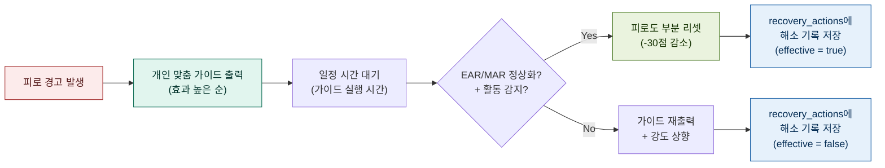

---

## 7. 웹 서버 (LAMP 스택)

### 7.1 LAMP 스택 구성

| 계층 | 기술 | 역할 |
|------|------|------|
| **L**inux | Raspberry Pi OS (Debian 기반) | 운영체제 |
| **A**pache | Apache 2.4 | 웹 서버 |
| **M**ySQL | MariaDB 10.x | 이력, 프로필, 패턴, 설정값 저장 |
| **P**HP | PHP 8.x | 백엔드 API, 이력/프로필/패턴 조회 |

### 7.2 데이터베이스 스키마

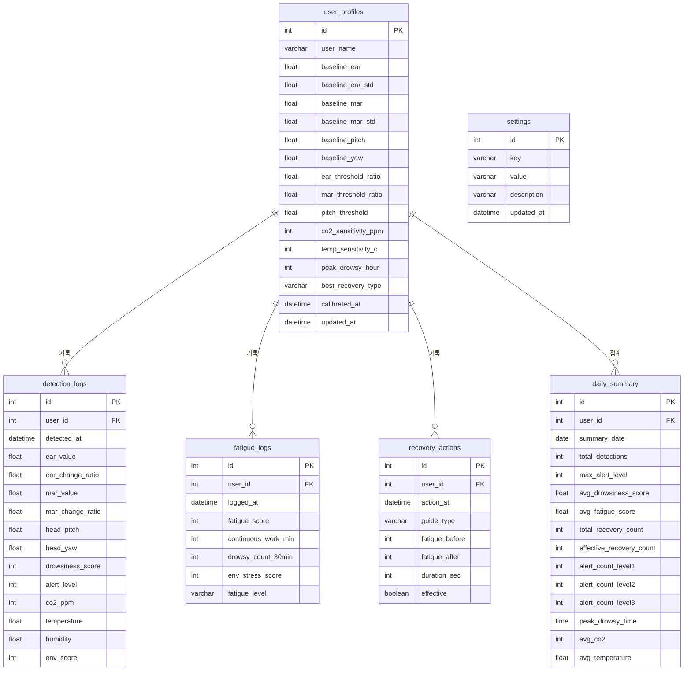

### 7.3 주요 PHP API 엔드포인트

| 엔드포인트 | 메서드 | 설명 |
|------------|--------|------|
| `/` | GET | 메인 페이지 (개인 맞춤 대시보드) |
| `/api/profile.php` | GET/POST | 개인 프로필 조회/수정 (캘리브레이션 결과 포함) |
| `/api/logs.php` | GET | 감지 이력 목록 (페이징 지원) |
| `/api/fatigue.php` | GET | 피로도 이력 및 추이 데이터 |
| `/api/recovery.php` | GET | 피로 해소 기록 및 효과 분석 |
| `/api/pattern.php` | GET | 시간대별 졸음 패턴 / 해소법 효과 분석 결과 |
| `/api/environment.php` | GET | 환경 센서 이력 (CO₂/온도/습도) |
| `/api/settings.php` | GET/POST | 임계값, 가중치 설정 조회/변경 |
| `/api/daily_report.php` | GET | 일간 요약 리포트 |

### 7.4 Python ↔ MySQL 연동 방식

```
[Python AI 엔진] --INSERT--> [MySQL/MariaDB] --SELECT--> [PHP API] --JSON--> [웹 브라우저]
```

Python과 PHP가 DB를 매개로 완전히 분리되어, 각각 독립적으로 개발·디버깅이 가능하다.

---

## 8. 개발 단계

개발은 6단계로 나누어 진행하며, 각 단계의 마일스톤 달성을 확인한 후 다음 단계로 넘어간다.

### 8.1 단계별 로드맵

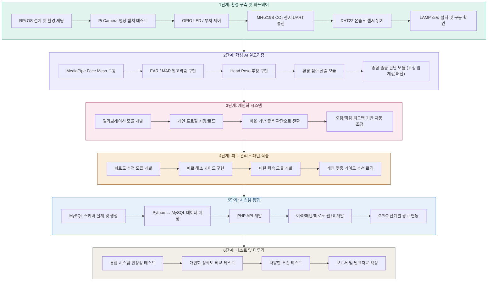

### 8.2 단계별 상세 내용

#### 1단계: 환경 구축 및 하드웨어 테스트

- Raspberry Pi OS 설치, Python 3.9+, OpenCV, MediaPipe 설치
- Pi Camera V2 연결 및 영상 캡처 테스트
- GPIO 핀으로 RGB LED, 부저 개별 제어 확인
- MH-Z19B CO₂ 센서 UART 통신 테스트
- DHT22 온습도 센서 데이터 읽기 테스트
- LAMP 스택 설치: Apache, MariaDB, PHP 설치 및 기본 동작 확인
- **마일스톤**: 카메라 영상 출력 + LED 점멸 + CO₂/온습도 값 콘솔 출력 + Apache 접속 확인

#### 2단계: 핵심 AI 알고리즘 구현

- MediaPipe Face Mesh로 468개 랜드마크 추출
- EAR, MAR 계산 함수 구현
- Head Pose Estimation 구현
- 환경 점수 산출 모듈 개발
- 종합 졸음 판단 모듈 개발 (우선 고정 임계값으로 동작 확인)
- **마일스톤**: 고정 임계값 기반 졸음 감지 + 환경 점수 반영 동작 확인

#### 3단계: 개인화 시스템 구현

- 캘리브레이션 모듈 개발 (30초 측정 → baseline 산출)
- user_profiles 테이블에 개인 프로필 저장/로드
- 고정 임계값을 비율 기반 판단으로 전환
- 오탐/미탐 피드백 기반 임계값 자동 조정 로직
- **마일스톤**: 눈 크기가 다른 2명 이상으로 테스트하여 개인화 전후 정확도 비교

#### 4단계: 피로 관리 + 패턴 학습

- 피로도 추적 모듈 개발 (연속 작업, 졸음 빈도, 환경 스트레스)
- 피로 해소 가이드 데이터 구성 및 출력 구현
- 시간대별 졸음 패턴 분석, 해소법 효과 분석, 환경 민감도 학습
- 학습 결과 기반 가이드 우선순위 재정렬 로직
- **마일스톤**: 졸음 반복 시 개인 맞춤 가이드 자동 제공 + 패턴 리포트 출력

#### 5단계: 시스템 통합

- MySQL 스키마 설계 및 전체 테이블 생성
- Python → MySQL 데이터 저장 모듈 개발
- PHP REST API 개발 (프로필, 이력, 피로도, 패턴, 환경)
- 이력 조회, 패턴 분석, 피로도 통계 웹 UI 개발
- GPIO 단계별 경고 연동
- **마일스톤**: 전체 파이프라인 동작 (감지 → 개인화 판단 → 경고 → DB → 웹 조회)

#### 6단계: 테스트 및 마무리

- 통합 시스템 안정성 테스트 (장시간 연속 가동)
- 개인화 정확도 비교: 고정 임계값 vs 비율 기반 (정밀도, 재현율, F1-score)
- 다양한 조건 테스트: 안경 착용, 어두운 환경, 다양한 각도
- 피로 해소 가이드 효과 검증 (가이드 전후 졸음 점수 비교)
- 패턴 학습 효과 검증 (1주 사용 후 추천 정확도 변화)
- 프로젝트 보고서 작성 및 발표 준비
- **마일스톤**: 라이브 데모 가능한 완성 시스템

---

## 9. 개발 전략

### 9.1 데스크탑 선행 개발 → RPi 이식


- 코어 AI + 개인화 로직은 데스크탑에서 웹캠으로 먼저 개발
- 환경 센서는 데스크탑에서 더미 데이터로 테스트 후 RPi에서 실제 연결
- LAMP 웹 파트는 XAMPP로 병행 개발
- 카메라 입력부, GPIO, 센서 통신부만 RPi에서 조정

### 9.2 Python ↔ LAMP 분리 아키텍처의 장점

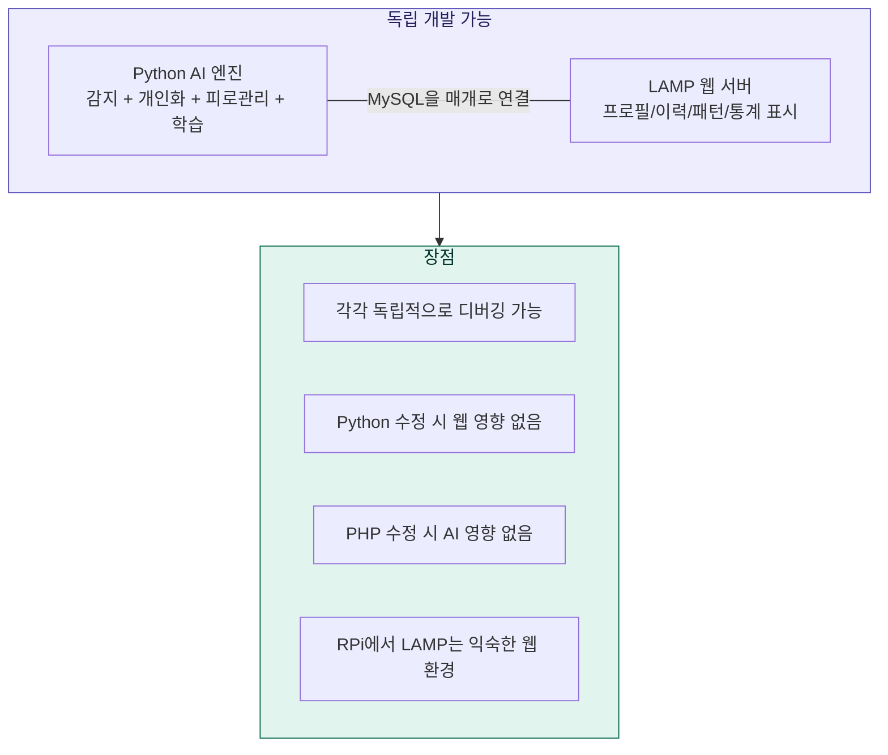

---

## 10. 프로젝트 디렉토리 구조

```
drowsiness-detection/
├── main.py                    # 메인 실행 파일 (AI 엔진)
├── config.py                  # 설정값 (가중치, GPIO 핀, DB 접속정보)
├── requirements.txt           # Python 패키지 목록
│
├── modules/
│   ├── camera.py              # 카메라 캡처 모듈
│   ├── face_detector.py       # MediaPipe 얼굴 랜드마크
│   ├── drowsiness.py          # EAR / MAR 계산
│   ├── head_pose.py           # 고개 기울기 추정
│   ├── env_sensor.py          # CO₂ (MH-Z19B) + 온습도 (DHT22)
│   ├── calibration.py         # 캘리브레이션 (30초 baseline 측정)
│   ├── user_profile.py        # 개인 프로필 저장/로드/업데이트
│   ├── judge.py               # 개인 맞춤 졸음 판단 (비율 기반)
│   ├── fatigue_manager.py     # 피로도 추적 + 맞춤 해소 가이드
│   ├── recovery_guide.py      # 피로 해소 가이드 데이터 및 출력
│   ├── pattern_learner.py     # 패턴 학습 (시간대/해소법/민감도)
│   ├── alert.py               # GPIO 경고 출력 제어
│   └── db_writer.py           # MySQL 데이터 저장
│
├── data/
│   └── guides.json            # 피로 해소 가이드 데이터 (JSON)
│
├── web/                       # Apache DocumentRoot (/var/www/html)
│   ├── index.php              # 메인 페이지 (개인 맞춤 대시보드)
│   ├── api/
│   │   ├── profile.php        # 개인 프로필 API
│   │   ├── logs.php           # 감지 이력 API
│   │   ├── fatigue.php        # 피로도 이력 API
│   │   ├── recovery.php       # 해소 기록 API
│   │   ├── pattern.php        # 패턴 분석 API
│   │   ├── environment.php    # 환경 센서 이력 API
│   │   ├── settings.php       # 설정 조회/변경 API
│   │   └── daily_report.php   # 일간 리포트 API
│   ├── includes/
│   │   └── db.php             # MySQL 접속 공통 모듈
│   ├── css/
│   │   └── style.css          # 웹 스타일
│   └── js/
│       ├── main.js            # 페이지 로직
│       └── chart_config.js    # Chart.js 설정
│
├── sql/
│   └── schema.sql             # MySQL 테이블 생성 스크립트
│
├── tests/
│   ├── test_ear.py            # EAR 알고리즘 단위 테스트
│   ├── test_mar.py            # MAR 알고리즘 단위 테스트
│   ├── test_calibration.py    # 캘리브레이션 단위 테스트
│   ├── test_judge.py          # 개인화 졸음 판단 테스트
│   ├── test_fatigue.py        # 피로도 관리 단위 테스트
│   ├── test_pattern.py        # 패턴 학습 단위 테스트
│   ├── test_env_sensor.py     # 환경 센서 단위 테스트
│   └── test_gpio.py           # GPIO 동작 테스트
│
└── docs/
    ├── project.md             # 프로젝트 문서 (본 파일)
    └── wiring_diagram.md      # 배선도
```

---

## 11. 참고 기술 및 라이브러리

### 11.1 AI / 임베디드 (Python)

| 기술 | 버전 | 용도 |
|------|------|------|
| Python | 3.9+ | 메인 AI 엔진 개발 언어 |
| OpenCV | 4.8+ | 영상 처리 |
| MediaPipe | 0.10+ | 얼굴 랜드마크 추출 |
| RPi.GPIO | 0.7+ | GPIO 핀 제어 |
| pymysql | 1.1+ | Python → MySQL 데이터 저장 |
| pyserial | 3.5+ | MH-Z19B UART 통신 |
| Adafruit_DHT | 1.4+ | DHT22 센서 읽기 |
| NumPy | 1.24+ | baseline 통계 계산 (평균/표준편차) |

### 11.2 웹 서버 (LAMP 스택)

| 기술 | 버전 | 용도 |
|------|------|------|
| Raspberry Pi OS | Debian 12 기반 | Linux 운영체제 |
| Apache | 2.4+ | 웹 서버 |
| MariaDB | 10.x | 관계형 데이터베이스 |
| PHP | 8.x | 백엔드 API |
| Chart.js | 4.x | 통계/패턴 그래프 시각화 |

---

## 12. 예상 성과 및 확장 가능성

### 예상 성과
- 졸음 감지 정확도: 90% 이상 (개인화 비율 기반, 고정 임계값 대비 향상)
- 실시간 처리 속도: 10\~15fps (RPi 4 기준)
- 경고 응답 시간: 졸음 감지 후 1초 이내
- 피로 해소 가이드 효과: 가이드 제공 후 졸음 점수 20% 이상 감소 목표
- 개인화 효과: 고정 임계값 대비 오탐률 30% 이상 감소 목표

### 향후 확장
- 스마트폰 실시간 모니터링 (MJPEG 스트리밍 + AJAX 대시보드)
- 스마트워치 연동 (심박수, GSR 데이터 추가)
- 소형 팬, 진동 모터 등 추가 경고/각성 장치 확장
- TFLite 경량 모델 학습 (개인별 졸음/피로 패턴 딥러닝)
- 다중 사용자 동시 감지 (교실, 사무실 환경)
- 차량 환경 적용 (OBD-II 연동, CAN 통신)
