# AIoT 기반 졸음 및 집중력 저하 방지 시스템

## 1. 프로젝트 개요

| 항목 | 내용 |
|------|------|
| 프로젝트명 | AIoT 기반 졸음 및 집중력 저하 방지 시스템 |
| 전공 | 임베디드 소프트웨어 |
| 개발 인원 | 1인 |
| 핵심 기술 | Raspberry Pi, MediaPipe, OpenCV, LAMP Stack, GPIO |

본 프로젝트는 Raspberry Pi에 카메라와 환경 센서를 연결하여 사용자의 얼굴을 실시간으로 분석하고, AI 기반 졸음 및 집중력 저하를 감지하여 단계적 경고를 출력하는 임베디드 AIoT 시스템이다. 엣지 디바이스에서 직접 AI 추론을 수행하며, 졸음 감지 시 상황에 맞는 피로 해소 가이드를 제공한다. LAMP 스택 기반 웹 서버를 통해 감지 이력 저장, 피로도 리포트 조회 및 피로 관리 기능을 제공한다.

---

## 2. 시스템 구성도

### 2.1 전체 시스템 아키텍처

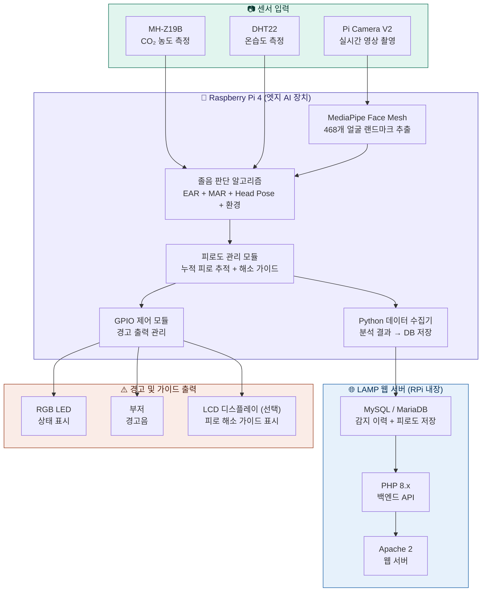

### 2.2 LAMP 스택 데이터 흐름

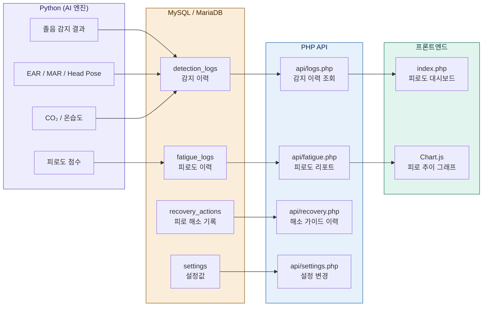

### 2.3 소프트웨어 모듈 구조

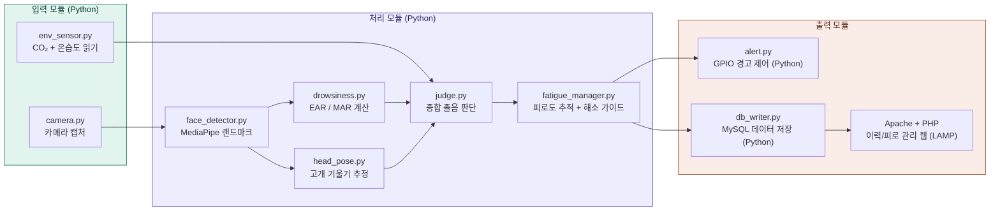

---

## 3. 하드웨어 구성

### 3.1 부품 목록

| 부품 | 모델 | 용도 |
|------|------|------|
| 메인 보드 | Raspberry Pi 4 (4GB) | 엣지 AI 처리 + LAMP 서버 |
| 카메라 | Pi Camera V2 | 얼굴 영상 촬영 |
| CO₂ 센서 | MH-Z19B | 이산화탄소 농도 측정 |
| 온습도 센서 | DHT22 | 실내 온도/습도 측정 |
| RGB LED | 공통 캐소드 | 상태 표시 (녹/황/적) |
| 부저 | 능동 부저 | 경고음 출력 |
| 기타 | 점퍼선, 브레드보드, 거치대 | 조립 및 고정 |

### 3.2 GPIO 핀 배치

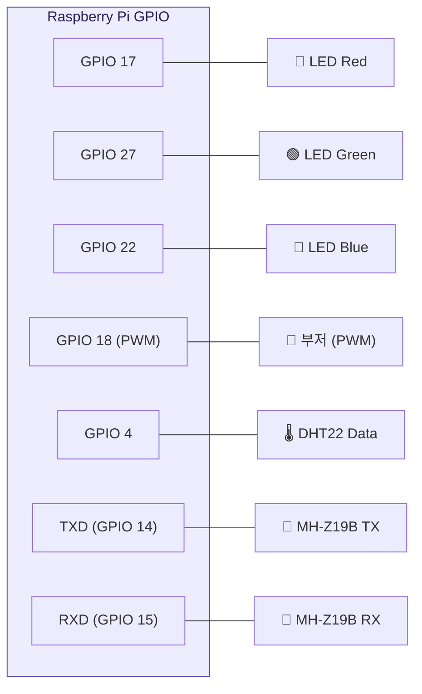

### 3.3 환경 센서 사양

| 센서 | 측정 범위 | 정확도 | 통신 방식 | 졸음 임계값 |
|------|-----------|--------|-----------|-------------|
| MH-Z19B (CO₂) | 0~5000ppm | ±50ppm | UART (9600bps) | 1000ppm 이상 → 집중력 저하 |
| DHT22 (온습도) | -40~80°C / 0~100%RH | ±0.5°C / ±2%RH | 디지털 1-Wire | 26°C 이상 → 졸음 유발 |

---

## 4. 핵심 알고리즘

### 4.1 졸음 감지 흐름

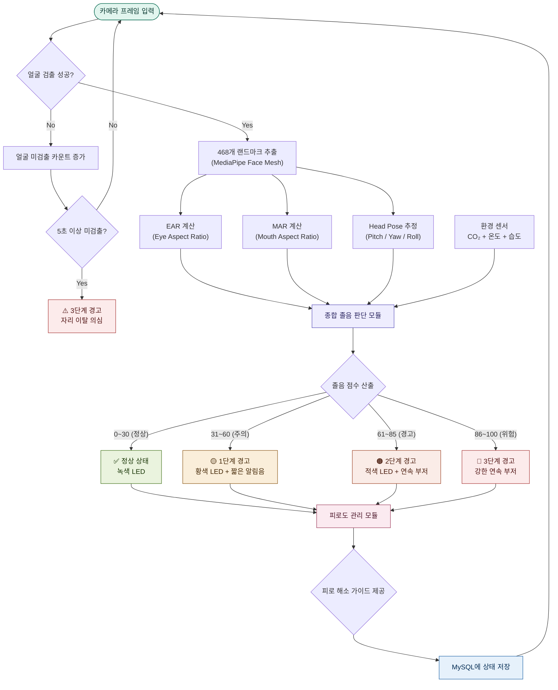

### 4.2 EAR (Eye Aspect Ratio) 계산

눈의 세로 길이 대비 가로 길이 비율로, 눈을 감으면 값이 급격히 감소한다.

```
EAR = (|P2 - P6| + |P3 - P5|) / (2 × |P1 - P4|)

- P1, P4: 눈의 좌우 끝점 (가로)
- P2, P3: 눈의 상단 점 (세로)
- P5, P6: 눈의 하단 점 (세로)

임계값: EAR < 0.2 → 눈 감김 판정
지속 시간: 2초 이상 연속 감김 → 졸음 판정
```

### 4.3 MAR (Mouth Aspect Ratio) 계산

입의 벌어진 정도를 측정하여 하품을 감지한다.

```
MAR = (|P2 - P6| + |P3 - P5|) / (2 × |P1 - P4|)

임계값: MAR > 0.6 → 하품 판정
빈도: 3분 내 3회 이상 하품 → 졸음 전조
```

### 4.4 종합 졸음 점수 산출

```
졸음 점수 = (W1 × EAR 점수) + (W2 × MAR 점수) + (W3 × Head Pose 점수) + (W4 × 환경 점수)

가중치 (기본값):
  W1 = 0.35  (눈 감김 — 가장 직접적인 지표)
  W2 = 0.25  (하품 빈도)
  W3 = 0.20  (고개 기울기)
  W4 = 0.20  (환경 — CO₂ + 온도 + 습도)

점수 범위: 0 (완전 각성) ~ 100 (완전 졸음)
```

### 4.5 환경 점수 산출

```
환경 점수 = (E1 × CO₂ 점수) + (E2 × 온도 점수) + (E3 × 습도 점수)

가중치:
  E1 = 0.50  (CO₂ — 졸음 유발 연관성이 가장 높음)
  E2 = 0.30  (온도)
  E3 = 0.20  (습도)

CO₂ 점수 산출:
  400~800ppm   → 0점 (쾌적)
  800~1000ppm  → 30점 (보통)
  1000~1500ppm → 60점 (나쁨, 환기 필요)
  1500ppm 이상 → 100점 (매우 나쁨)

온도 점수 산출:
  18~24°C → 0점 (쾌적)
  24~26°C → 40점 (약간 높음)
  26~28°C → 70점 (졸음 유발)
  28°C 이상 → 100점 (매우 높음)

습도 점수 산출:
  40~60%RH → 0점 (쾌적)
  60~70%RH → 40점 (약간 높음)
  70%RH 이상 → 80점 (불쾌)
```

---

## 5. 피로도 관리 시스템

### 5.1 피로도 관리 흐름

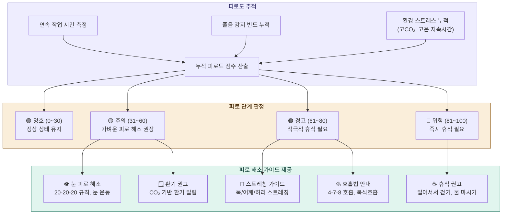

### 5.2 누적 피로도 점수 산출

```
피로도 = (F1 × 연속작업 점수) + (F2 × 졸음빈도 점수) + (F3 × 환경스트레스 점수)

가중치:
  F1 = 0.35  (연속 작업 시간)
  F2 = 0.40  (졸음 감지 빈도 — 가장 직접적)
  F3 = 0.25  (환경 스트레스 누적)

연속작업 점수:
  0~30분    → 0점
  30~60분   → 20점
  60~90분   → 50점
  90~120분  → 80점
  120분 이상 → 100점

졸음빈도 점수 (최근 30분 기준):
  0회     → 0점
  1~2회   → 30점
  3~5회   → 60점
  6회 이상 → 100점

환경스트레스 점수:
  CO₂ 1000ppm 이상이 10분 이상 지속 → +40점
  온도 26°C 이상이 10분 이상 지속   → +30점
  습도 70% 이상이 10분 이상 지속    → +20점
  (합산, 최대 100점)
```

### 5.3 피로 해소 가이드 상세

#### 단계별 가이드 매핑

| 피로 단계 | 트리거 조건 | 제공 가이드 | 출력 방식 |
|-----------|------------|-------------|-----------|
| 🟡 주의 (31~60) | 연속 작업 30분 이상 또는 졸음 1~2회 | 20-20-20 눈 휴식, 환기 권고 | LED 황색 + 콘솔 메시지 |
| 🟠 경고 (61~80) | 연속 작업 60분 이상 또는 졸음 3~5회 | 스트레칭, 호흡법, 환기 | LED 적색 + 부저 + 콘솔 |
| 🔴 위험 (81~100) | 연속 작업 90분 이상 또는 졸음 6회+ | 즉시 휴식, 일어서서 걷기, 물 마시기 | 강한 부저 + 콘솔 강조 |

#### 피로 해소 가이드 내용

**👁️ 눈 피로 해소 (20-20-20 규칙)**
- 20분마다 20초 동안 20피트(6m) 먼 곳 바라보기
- 눈 깜빡임 운동: 2초 감고 → 2초 뜨기를 5회 반복
- 안구 운동: 상하좌우, 원 그리기

**🧘 스트레칭 가이드**
- 목 스트레칭: 좌우 기울이기 각 15초
- 어깨 돌리기: 앞으로 10회, 뒤로 10회
- 허리 비틀기: 좌우 각 15초
- 손목 스트레칭: 손등 당기기 각 10초

**🫁 호흡법 안내**
- 4-7-8 호흡법: 4초 들이쉬고 → 7초 참고 → 8초 내쉬기 (3회 반복)
- 복식호흡: 배를 부풀리며 5초 들이쉬고 → 5초 내쉬기 (5회 반복)

**🪟 환기 권고 (CO₂ 기반)**
- CO₂ 1000ppm 이상: "실내 공기가 탁합니다. 창문을 열어 환기하세요."
- CO₂ 1500ppm 이상: "CO₂ 농도가 매우 높습니다. 즉시 환기가 필요합니다."
- 환기 후 CO₂가 800ppm 이하로 내려오면 자동 해제

**☕ 휴식 권고**
- 자리에서 일어나 2~3분 걷기
- 물 한 잔 마시기 (수분 부족은 피로 원인)
- 가벼운 간식 (혈당 유지)
- 5분 이상 완전한 휴식

### 5.4 피로 해소 확인 및 리셋

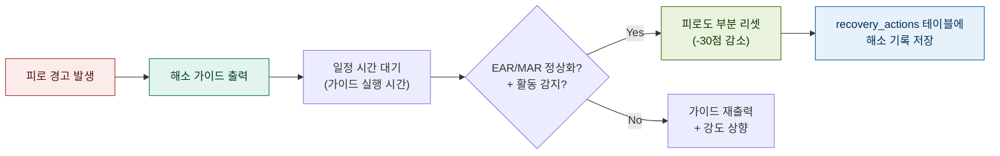

사용자가 가이드에 따라 스트레칭이나 휴식을 취한 후, 카메라를 통해 얼굴이 다시 정상 상태(EAR 정상, 하품 없음)로 돌아오면 피로도 점수를 부분적으로 감소시킨다. 이 과정을 recovery_actions 테이블에 기록하여, 어떤 해소 방법이 효과적이었는지 추후 분석할 수 있다.

---

## 6. 웹 서버 (LAMP 스택)

### 6.1 LAMP 스택 구성

| 계층 | 기술 | 역할 |
|------|------|------|
| **L**inux | Raspberry Pi OS (Debian 기반) | 운영체제 |
| **A**pache | Apache 2.4 | 웹 서버 |
| **M**ySQL | MariaDB 10.x | 감지 이력, 피로도, 설정값 저장 |
| **P**HP | PHP 8.x | 백엔드 API, 이력/피로도 조회 처리 |

LAMP 스택은 졸음 감지 이력과 피로도 데이터를 저장하고, 사후에 통계/리포트를 조회하며 피로 관리 현황을 확인하는 용도로 사용한다.

### 6.2 데이터베이스 스키마

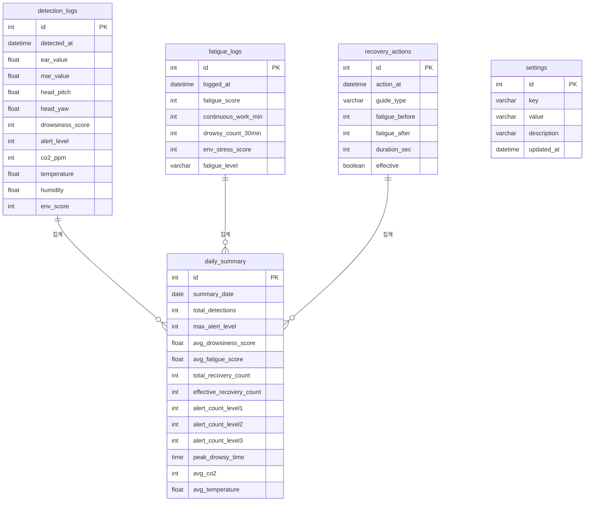

### 6.3 주요 PHP API 엔드포인트

| 엔드포인트 | 메서드 | 설명 |
|------------|--------|------|
| `/` | GET | 메인 페이지 (피로도 요약 + 환경 현황 + 통계) |
| `/api/logs.php` | GET | 감지 이력 목록 (페이징 지원) |
| `/api/fatigue.php` | GET | 피로도 이력 및 추이 데이터 (JSON) |
| `/api/recovery.php` | GET | 피로 해소 기록 및 효과 분석 (JSON) |
| `/api/environment.php` | GET | 환경 센서 이력 (CO₂/온도/습도) |
| `/api/settings.php` | GET/POST | 임계값, 가중치 설정 조회/변경 |
| `/api/daily_report.php` | GET | 일간 요약 리포트 (JSON) |

### 6.4 Python ↔ MySQL 연동 방식

Python AI 엔진은 `pymysql` 라이브러리를 사용하여 분석 결과를 MySQL에 직접 INSERT한다. PHP는 MySQL에서 데이터를 SELECT하여 웹 프론트엔드에 JSON으로 전달한다.

```
[Python AI 엔진] --INSERT--> [MySQL/MariaDB] --SELECT--> [PHP API] --JSON--> [웹 브라우저]
```

이 구조의 장점은 Python과 PHP가 DB를 매개로 완전히 분리되어, 각각 독립적으로 개발·디버깅이 가능하다는 것이다.

---

## 7. 개발 단계

개발은 5단계로 나누어 진행하며, 각 단계의 마일스톤 달성을 확인한 후 다음 단계로 넘어간다.

### 7.1 단계별 로드맵

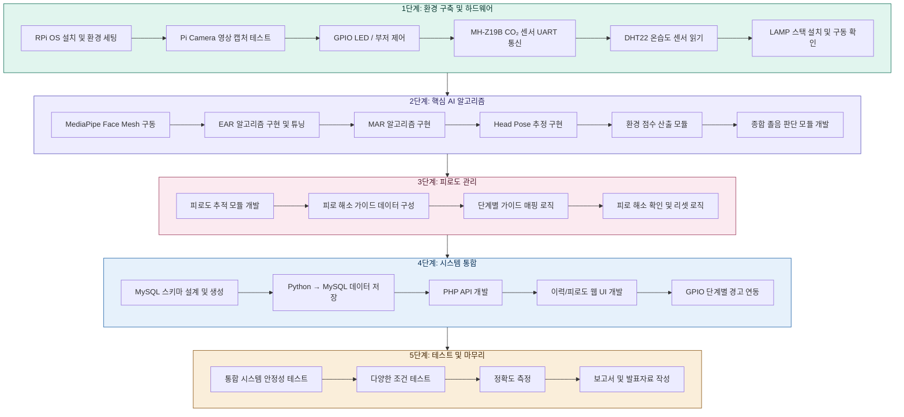

### 7.2 단계별 상세 내용

#### 1단계: 환경 구축 및 하드웨어 테스트

- Raspberry Pi OS 설치, Python 3.9+, OpenCV, MediaPipe 설치
- Pi Camera V2 연결 및 영상 캡처 테스트
- GPIO 핀으로 RGB LED, 부저 개별 제어 확인
- MH-Z19B CO₂ 센서 UART 통신 테스트 (시리얼로 ppm 값 읽기)
- DHT22 온습도 센서 데이터 읽기 테스트
- LAMP 스택 설치: Apache, MariaDB, PHP 설치 및 기본 동작 확인
- **마일스톤**: 카메라 영상 출력 + LED 점멸 + CO₂/온습도 값 콘솔 출력 + Apache 접속 확인

#### 2단계: 핵심 AI 알고리즘 구현

- MediaPipe Face Mesh로 468개 랜드마크 추출
- EAR (Eye Aspect Ratio) 계산 함수 구현
- MAR (Mouth Aspect Ratio) 계산 함수 구현
- Head Pose Estimation (Pitch/Yaw/Roll) 구현
- CO₂/온도/습도 기반 환경 점수 산출 모듈 개발
- 종합 졸음 판단 모듈 (영상 + 환경 가중 평균) 개발
- 임계값 튜닝 (다양한 사람, 안경 착용 등 테스트)
- **마일스톤**: 졸음 감지 + 환경 점수 반영된 종합 졸음 점수 산출

#### 3단계: 피로도 관리 시스템 구현

- 연속 작업 시간, 졸음 빈도, 환경 스트레스 기반 피로도 추적 모듈 개발
- 피로 해소 가이드 데이터(눈 운동, 스트레칭, 호흡법, 환기 권고) 구성
- 피로 단계별 가이드 매핑 로직 구현
- 카메라 기반 피로 해소 확인(정상 복귀 감지) 및 피로도 리셋 로직
- **마일스톤**: 졸음 반복 감지 시 적절한 피로 해소 가이드 자동 제공

#### 4단계: 시스템 통합

- MySQL 데이터베이스 스키마 설계 및 테이블 생성
- Python → MySQL 데이터 저장 모듈 (`db_writer.py`) 개발
- PHP REST API 개발 (이력, 피로도, 해소 기록, 환경 데이터 조회)
- 이력 조회 및 피로도 통계 웹 UI 개발 (HTML/CSS/JS + Chart.js)
- 졸음 점수에 따른 3단계 경고 GPIO 출력 연동
- **마일스톤**: 졸음 감지 → 경고 + 피로 가이드 + DB 저장 → 웹에서 이력/피로도 확인

#### 5단계: 테스트 및 마무리

- 통합 시스템 안정성 테스트 (장시간 연속 가동)
- 다양한 조건 테스트: 안경 착용, 어두운 환경, 다양한 각도
- 정확도 측정 (정밀도, 재현율, F1-score)
- 피로 해소 가이드 효과 검증 (가이드 전후 졸음 점수 비교)
- 일간 리포트 기능 확인 (daily_summary 집계)
- 프로젝트 보고서 작성
- 발표 자료 제작 및 리허설
- **마일스톤**: 라이브 데모 가능한 완성 시스템

---

## 8. 개발 전략

### 8.1 데스크탑 선행 개발 → RPi 이식

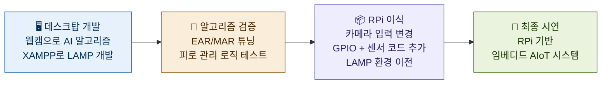

- 코어 AI 알고리즘 + 피로 관리 로직은 데스크탑에서 웹캠으로 먼저 개발
- 환경 센서(CO₂, 온습도)는 데스크탑에서 더미 데이터로 테스트 후 RPi에서 실제 연결
- LAMP 웹 파트는 데스크탑에 XAMPP 설치하여 병행 개발
- 카메라 입력부, GPIO 제어부, 센서 통신부, Apache 설정만 RPi에서 조정

### 8.2 Python ↔ LAMP 분리 아키텍처의 장점

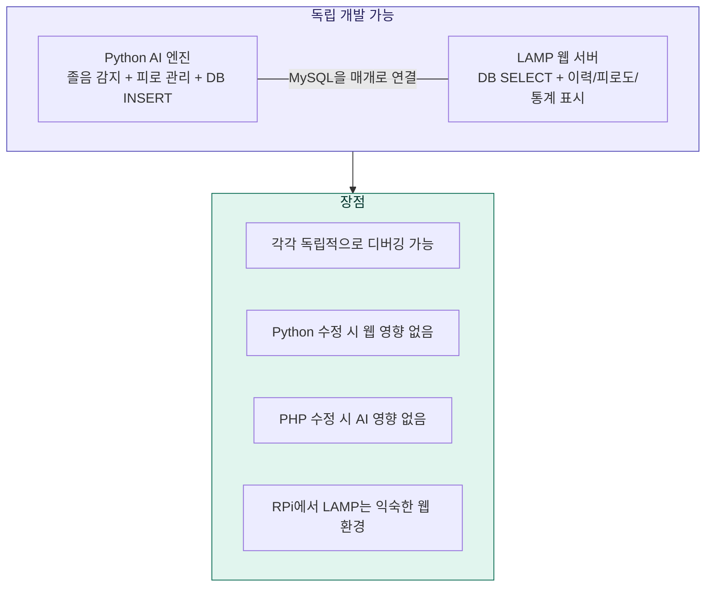

---

## 9. 프로젝트 디렉토리 구조

```
drowsiness-detection/
├── main.py                    # 메인 실행 파일 (AI 엔진)
├── config.py                  # 설정값 (임계값, 가중치, GPIO 핀, DB 접속정보)
├── requirements.txt           # Python 패키지 목록
│
├── modules/
│   ├── camera.py              # 카메라 캡처 모듈
│   ├── face_detector.py       # MediaPipe 얼굴 랜드마크
│   ├── drowsiness.py          # EAR / MAR 계산
│   ├── head_pose.py           # 고개 기울기 추정
│   ├── env_sensor.py          # CO₂ (MH-Z19B) + 온습도 (DHT22) 센서
│   ├── judge.py               # 종합 졸음 판단 (영상 + 환경)
│   ├── fatigue_manager.py     # 피로도 추적 + 해소 가이드 관리
│   ├── recovery_guide.py      # 피로 해소 가이드 데이터 및 출력
│   ├── alert.py               # GPIO 경고 출력 제어
│   └── db_writer.py           # MySQL 데이터 저장
│
├── data/
│   └── guides.json            # 피로 해소 가이드 데이터 (JSON)
│
├── web/                       # Apache DocumentRoot (/var/www/html)
│   ├── index.php              # 메인 페이지 (피로도 요약 + 통계)
│   ├── api/
│   │   ├── logs.php           # 감지 이력 API
│   │   ├── fatigue.php        # 피로도 이력 API
│   │   ├── recovery.php       # 해소 기록 API
│   │   ├── environment.php    # 환경 센서 이력 API
│   │   ├── settings.php       # 설정 조회/변경 API
│   │   └── daily_report.php   # 일간 리포트 API
│   ├── includes/
│   │   └── db.php             # MySQL 접속 공통 모듈
│   ├── css/
│   │   └── style.css          # 웹 스타일
│   └── js/
│       ├── main.js            # 페이지 로직
│       └── chart_config.js    # Chart.js 설정
│
├── sql/
│   └── schema.sql             # MySQL 테이블 생성 스크립트
│
├── tests/
│   ├── test_ear.py            # EAR 알고리즘 단위 테스트
│   ├── test_mar.py            # MAR 알고리즘 단위 테스트
│   ├── test_fatigue.py        # 피로도 관리 단위 테스트
│   ├── test_env_sensor.py     # 환경 센서 단위 테스트
│   └── test_gpio.py           # GPIO 동작 테스트
│
└── docs/
    ├── project.md             # 프로젝트 문서 (본 파일)
    └── wiring_diagram.md      # 배선도
```

---

## 10. 참고 기술 및 라이브러리

### 10.1 AI / 임베디드 (Python)

| 기술 | 버전 | 용도 |
|------|------|------|
| Python | 3.9+ | 메인 AI 엔진 개발 언어 |
| OpenCV | 4.8+ | 영상 처리 |
| MediaPipe | 0.10+ | 얼굴 랜드마크 추출 |
| RPi.GPIO | 0.7+ | GPIO 핀 제어 |
| pymysql | 1.1+ | Python → MySQL 데이터 저장 |
| pyserial | 3.5+ | MH-Z19B UART 통신 |
| Adafruit_DHT | 1.4+ | DHT22 센서 읽기 |

### 10.2 웹 서버 (LAMP 스택)

| 기술 | 버전 | 용도 |
|------|------|------|
| Raspberry Pi OS | Debian 12 기반 | Linux 운영체제 |
| Apache | 2.4+ | 웹 서버 |
| MariaDB | 10.x | 관계형 데이터베이스 |
| PHP | 8.x | 백엔드 API |
| Chart.js | 4.x | 통계 그래프 시각화 |

---

## 11. 예상 성과 및 확장 가능성

### 예상 성과
- 졸음 감지 정확도: 85% 이상 (EAR + MAR + Head Pose + 환경 융합)
- 실시간 처리 속도: 10~15fps (RPi 4 기준)
- 경고 응답 시간: 졸음 감지 후 1초 이내
- 피로 해소 가이드 효과: 가이드 제공 후 졸음 점수 20% 이상 감소 목표

### 향후 확장
- 스마트폰 실시간 모니터링 (MJPEG 스트리밍 + AJAX 대시보드)
- 스마트워치 연동 (심박수, GSR 데이터 추가)
- 소형 팬, 진동 모터 등 추가 경고/각성 장치 확장
- TFLite 경량 모델 학습 (개인별 졸음/피로 패턴 맞춤)
- 피로 해소 가이드 개인화 (효과 데이터 기반 추천 알고리즘)
- 차량 환경 적용 (OBD-II 연동, CAN 통신)
- 다중 사용자 지원 (로그인, 개인별 데이터 분리)
